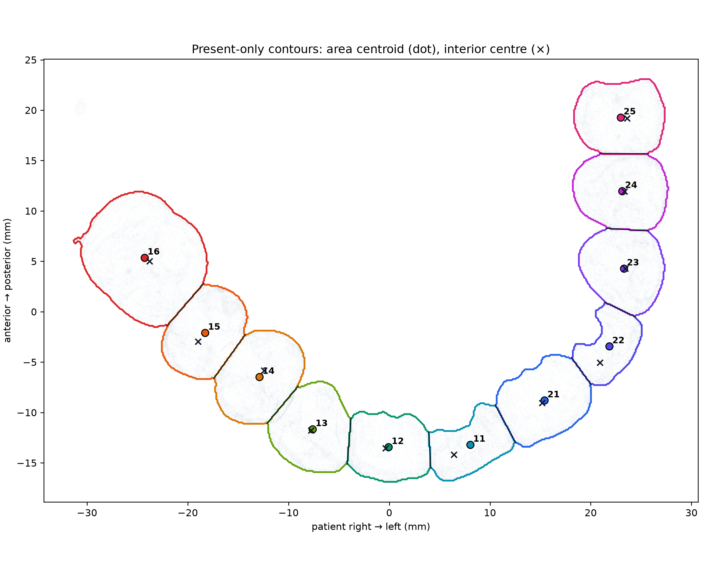
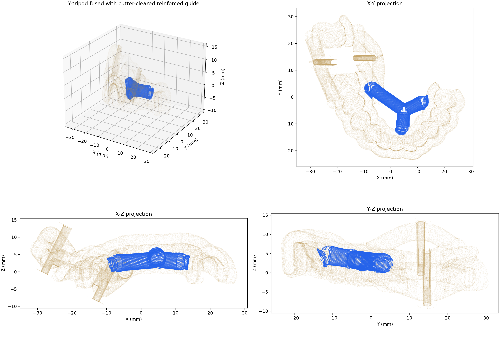
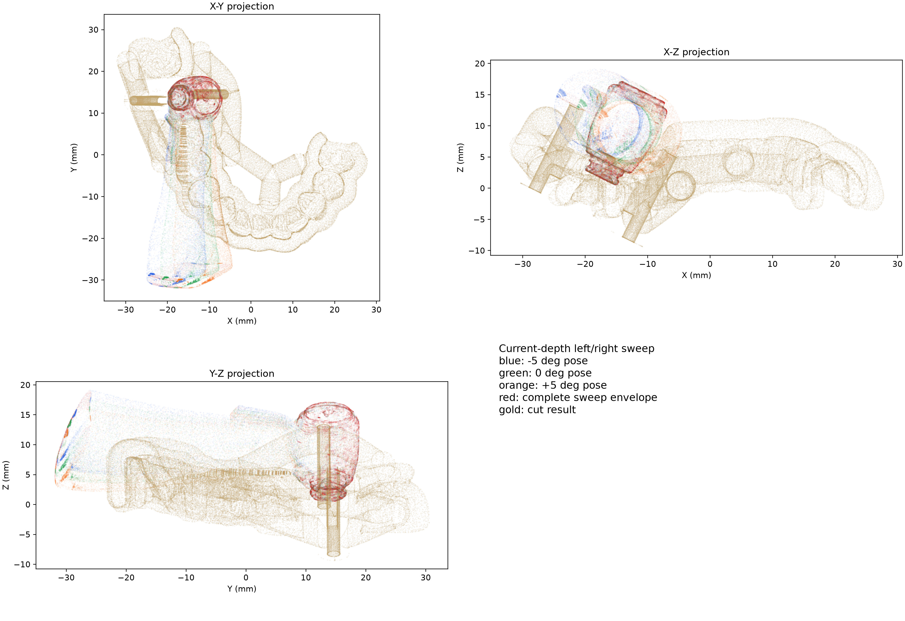

# TwinGuide

TwinGuide 面向双导套牙科导板的自动化建模，负责输入导管识别、导孔与窗口规划、
结构连接、Blender 实体化、STL 导出和独立检查。

## 问题描述

已有牙科导板提供与患者牙列匹配的基体，导套装配体给出两个导套及其操作结构的
位置和尺寸。需要在不改变装配关系的前提下，在牙科导板上形成与导套同轴的导孔，
开设操作窗和观察窗，并用平滑、连通的结构将导套与牙科导板连接为一体。

完整目标还包括识别牙位、构建按压梁柱，以及根据患者牙列、牙科手机运动包络和必须保留的
功能区调整连接结构。最终模型应保持导孔、导套固定孔和窗口通畅，各结构互相连通，
并满足所需净距，输出可供后续制造和检查的一体化牙科导板 STL。

程序使用以下三个病例网格：

<table>
  <tr>
    <td width="33.3%" align="center"></td>
    <td width="33.3%" align="center"></td>
    <td width="33.3%" align="center"></td>
  </tr>
  <tr>
    <td align="center">牙科导板</td>
    <td align="center">导套装配体</td>
    <td align="center">患者牙列扫描</td>
  </tr>
</table>

输入网格的坐标、单位和网格质量要求见使用指南中的“输入数据”页。

## 输入与病例配置

每个病例由运行 JSON 和病例 YAML 共同定义，两者在内存中合并，不生成中间配置文件：

| 配置 | 主要职责 |
| --- | --- |
| `examples/case-*.json` | 输入网格路径、导管尺寸、融合精度、通用几何参数、渲染尺寸和输出目录 |
| `data/cases/<cohort>/<case>/case.yaml` | 上下颌与 FDI 牙位、种植位和对象对应关系、导管使用模式、操作窗/观察窗、每个导板锚点、按压梁、特殊拓扑和人工审核状态 |

牙位以人工提供的信息为准。`present_teeth`、`missing_teeth` 和
`excluded_teeth` 必须互斥并符合相应牙颌的 FDI 编码：上颌为
`18…11, 21…28`，下颌为 `38…31, 41…48`。算法在这些约束内完成牙位中心、
牙轴和局部牙弓方向的计算，不用历史牙位报告覆盖当前 YAML。

规范病例目录支持单颗和多颗种植位：

- `data/cases/single/tooth-<FDI>/`
- `data/cases/multiple/teeth-<FDI>-<FDI>/`

每个目录包含 `case.yaml` 与 `input/`；JSON 中的相对路径以 JSON 文件所在目录为基准。

## 当前统一流程

TwinGuide 的业务算法均位于项目内部，不依赖外部 `scripts/`、历史映射 JSON 或兄弟项目模块。

| 阶段 | 当前处理 |
| --- | --- |
| 1. 导管识别 | 排除轴线上没有真实孔道的 cutter，按尺寸、轴向和平行度选择有效导管，并应用 YAML 指定的导管模式 |
| 2. 牙位映射 | 读取人工牙位约束，识别牙冠范围与中心，建立 FDI 映射、牙弓坐标和左右方向一致性 |
| 3. 导孔与窗口 | 沿导管轴线生成导孔，按种植位生成操作窗，并按 FDI 起止牙位生成轴扫掠观察窗 |
| 4. 连接锚点 | 计算导管侧高/低 Q/P 点；每个导板锚点独立按牙位站位、U/背 U 侧和射线角度定位 |
| 5. 按压梁 | 按病例配置选择导管端和牙位端锚点，可选生成三臂 Y 型按压梁 |
| 6. 结构连接 | 生成四根连续曲线梁，并按需加入跨组件梁、末端 U 型延伸或远中公共节点 |
| 7. 手机避让 | 根据手机 STL 与止挡报告构造当前深度左右摆动包络，在最终整体上执行差集 |

正式生成会输出 `twin_guide.stl` 和各阶段诊断图。若病例没有有效牙位映射，程序不会
猜测观察窗；若必需几何或质量检查失败，则明确停止而不是静默回退到历史结果。

## 关键建模规则

### 导管使用模式

`case.yaml` 中的 `design.sleeve_geometry.mode` 控制导管来源：

| 模式 | 行为 | 导孔与连通体处理 |
| --- | --- | --- |
| `generated` | 从输入装配体提取位姿，按 JSON 尺寸重建标准导管 | 融合后全局复切标准导孔，并保留目标最大连通体 |
| `input` | 直接保留识别出的真实输入导管 | 只在加入输入导管前清除导板/连接梁侵入导孔的部分；加入后不全局复切，也不以“只留最大连通体”删除受保护导管，仅清理小于 1.5 个体素的伪影 |

两种模式共用同一套导管识别、牙位映射、窗口、锚点和连接流程。`input` 模式不会为了
通过检查而改变输入导管自身的孔道；若源导管孔道堵塞，验证会提示人工复核。

### 观察窗与操作窗

- 当前观察窗以两端牙位轴点为旋转轴，按牙弓外侧方向扫掠切面；默认有效高度
  `0.2 mm`、扫掠角度 `90°`。
- 仅当局部轴行没有形成有效切口时，依次以 `0.5、1.0、2.0 mm` 重试；其他位置
  保持 `0.2 mm`，全部失败时保留最后一次尝试并标记失败。
- 操作窗的切向、副切向和轴向外扩余量在 YAML 的
  `planning.operation_windows` 中按种植位配置；观察窗范围在
  `design.observation_windows` 中用起止 FDI 牙位定义。

### 连接梁锚点

`design.guide_anchors.anchors` 为每个导板侧锚点分别设置：

- `endpoint`：该锚点属于连续路径的哪一个端部；
- `station`：单牙中心 `tooth_center` 或双牙中点 `tooth_pair_midpoint`；
- `side`：`u_side` 或 `back_u_side`；
- `ray_angle_degrees`：从牙位局部坐标发射到导板外表面的角度。

因此同一站位的 U 侧和背 U 侧锚点可以使用不同角度，也可以让四个锚点分别引用不同牙位。
连接梁侵入导孔的部分会在相应导管模式规定的复切阶段删除。

`design.algorithms.profile: current` 是规范流程。`legacy_merge` 仅用于算法对照，保留
固定 7 mm 表面缺口观察窗和每导管四根独立 Bézier 梁；观察窗和连接器也可单独覆盖，
详见[病例配置](docs/guide/configuration.md)。

## 功能与结果

<table>
  <tr>
    <td width="50%" align="center"></td>
    <td width="50%" align="center"></td>
  </tr>
  <tr><td align="center">1. 导管识别与实体模式选择</td><td align="center">2. 牙位识别与导板映射</td></tr>
  <tr>
    <td align="center"></td>
    <td align="center"></td>
  </tr>
  <tr><td align="center">3. 导孔与窗口规划</td><td align="center">4. 导套与牙科导板联建锚点选择</td></tr>
  <tr>
    <td align="center"></td>
    <td align="center"></td>
  </tr>
  <tr><td align="center">5. 按压梁柱锚点选择</td><td align="center">6. 四根连续曲线梁生成与模式化固定孔处理</td></tr>
  <tr>
    <td align="center"></td>
    <td align="center"></td>
  </tr>
  <tr><td align="center">7. 手机当前深度左右摆动避让</td><td align="center">当前版本输出的牙科导板 STL</td></tr>
</table>

## 安装与运行

TwinGuide 支持 Python 3.13–3.14，网格建模使用 Blender 5.2 LTS。
标准环境使用 Blender 5.2 自带的 Python 3.13 和项目局部依赖目录，
不会修改 Blender 应用内的 `site-packages`。

### 1. 准备环境

```bash
./setup-blender-env.sh
./blender-env.sh --background --factory-startup --python verify-blender-env.py
```

依赖版本锁定在 `requirements-blender.lock.txt`。`blender-env.sh` 只加载项目内的
`.blender-site-packages`、`src/` 和项目根目录。

### 2. 生成并立即验证

```bash
./blender-env.sh --background --python run.py -- \
  generate --config examples/case-tooth-11.json --validate
```

`generate` 执行完整七阶段流程、实体化和 STL 导出。`--validate` 在同一运行中对最终
模型执行独立检查；任一检查失败时命令返回非零状态。正式生成默认拒绝
`case.yaml` 中明确标记为 `pending_user_input`、`pending` 或 `unreviewed` 的病例。
只有在明确了解风险的诊断场景中才使用 `--allow-unreviewed`。

### 3. 仅查看阶段计算

```bash
./blender-env.sh --background --python run.py -- \
  process --config examples/case-tooth-11.json
```

`process` 输出各阶段的 `completed` 或 `skipped` 状态并计算中间几何，但不实体化和导出 STL。

### 4. 独立检查已有 STL

```bash
./blender-env.sh --background --python run.py -- validate \
  --config examples/case-tooth-11.json \
  --model output/tooth_11/twin_guide.stl
```

示例配置统一命名为 `examples/case-tooth-<牙号>.json`，生成结果写入
`output/tooth_<牙号>`；多颗病例使用 `case-teeth-*.json` 和 `output/teeth_*`。
导管尺寸、连接梁直径、融合体素和窗口余量均以病例配置为准，不应把示例数值视为
所有病例的固定常量。

## 主要输出

| 文件 | 内容 |
| --- | --- |
| `twin_guide.stl` | 最终一体化导板模型 |
| `selected_input_sleeves.png` | `input` 模式实际采用的输入导管 |
| `generated_sleeves.png` | `generated` 模式重建的标准导管 |
| `cutouts.png` | 导孔、操作窗和 FDI 观察窗诊断图 |
| `link_points.png` | 导管侧与导板侧连接锚点 |
| `guide_connectors.png` | 连续连接梁与可选附加结构 |
| `guide_*.png` | 最终模型标准视图 |
| `handpiece_avoidance/` | 手机运动包络与避障报告；多手机时按 ID 分目录 |

## 质量验证

`validate` 不修改最终模型，当前检查：

- 网格边界、非流形边、重复三角形和异常小连通分量；
- 当前模式下的导管保留率及输入导管来源；
- 连续连接梁中心线、导板端根部球和曲面贴合脚的覆盖；
- 可选 Y 型按压梁及特殊连接结构；
- 导孔多截面、多半径探针通畅性；
- 每个 FDI 观察窗的样本净空和局部阻塞。

`generated` 模式允许在融合后全局复切标准导孔；`input` 模式验证真实导管是否被保留，
但不会重钻其源孔道。手机运动包络在 `generate` 中完成差集，独立 `validate` 不重复构造包络。

项目当前规范配置已完成单颗和多颗共 12 个病例的全流程回归；代码级回归包含 101 项
单元测试。该结果说明当前病例集通过，不替代新病例的 YAML 人工审核、过程图复核和
最终制造前检查。

## 项目结构

| 路径 | 内容 |
| --- | --- |
| `src/twin_guide/` | 七阶段建模、实体生成、验证和 CLI |
| `src/twin_guide/tooth_mapping/` | 项目内置牙位识别与导板映射 |
| `src/twin_guide/observation_window_engine.py` | FDI 轴扫掠观察窗核心算法 |
| `data/cases/` | 单颗/多颗规范病例、YAML 和输入数据 |
| `examples/` | JSON 运行入口 |
| `tests/` | 单元、集成和回归测试 |
| `docs/` | 配置、流程、建模细节和 API 文档 |

<!-- sphinx-homepage-end -->

## 文档

- [使用指南](https://ziyangg98.github.io/TwinGuide/guide/index.html)
- [生成过程](https://ziyangg98.github.io/TwinGuide/process/index.html)
- [程序设计](https://ziyangg98.github.io/TwinGuide/design/index.html)
- [Python API 参考](https://ziyangg98.github.io/TwinGuide/public_api.html)
