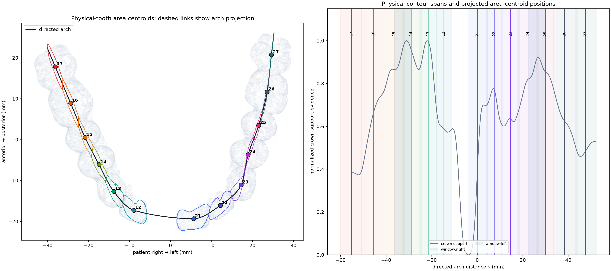
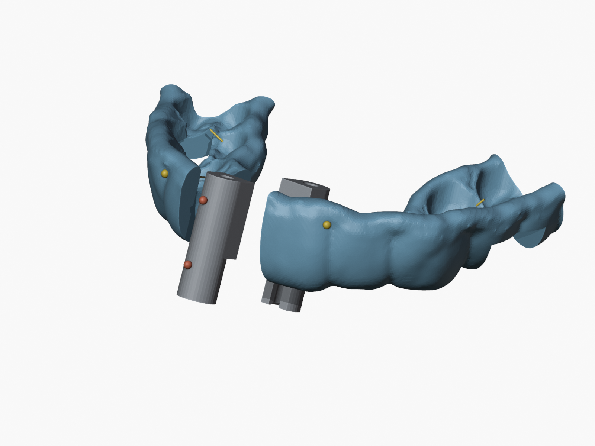
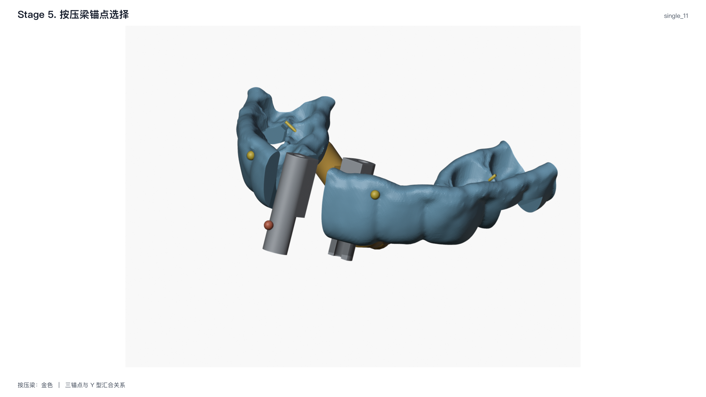
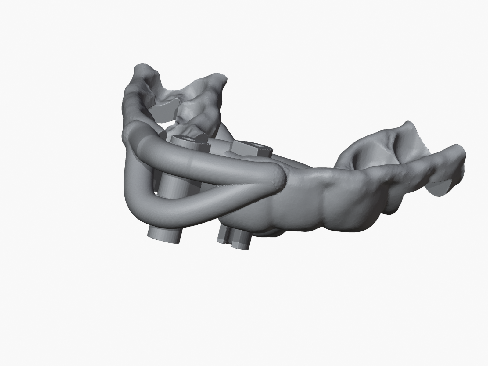

# TwinGuide

TwinGuide 是基于 Blender 的双导管牙科导板建模工具。程序从牙科导板、导管
装配体和患者牙列网格出发，规划导孔、观察窗、连接梁、按压梁和手机避让，
最终导出一体化 STL 并执行独立验证。

<table>
  <tr>
    <td width="33.3%" align="center"></td>
    <td width="33.3%" align="center"></td>
    <td width="33.3%" align="center"></td>
  </tr>
  <tr>
    <td align="center">牙科导板</td>
    <td align="center">导管装配体</td>
    <td align="center">患者牙列</td>
  </tr>
</table>

## 统一流程

| 阶段 | 输入 | 输出 | 成熟度 |
| --- | --- | --- | --- |
| 1. 导管识别 | 导管装配体、牙科导板 | 导管位姿与标准重建 | 稳定 |
| 2. 牙位识别 | 患者牙列、病例语义 | FDI 牙位与导板映射 | 实验 |
| 3. 窗口规划 | 导管与牙位结果 | 导孔、操作窗、观察窗 | 实验 |
| 4. 锚点选择 | 导管、窗口与牙位结果 | 导管端和导板端锚点 | 实验 |
| 5. 按压梁 | 锚点与病例设计 | 按压梁计划 | 实验 |
| 6. 结构连接 | 全部锚点 | 连续连接梁计划 | 实验 |
| 7. 手机避让 | 手机模型与止挡报告 | 最终净距调整计划 | 实验 |

<table>
  <tr>
    <td width="50%" align="center"></td>
    <td width="50%" align="center"></td>
  </tr>
  <tr>
    <td align="center">1. 导管识别与标准重建</td>
    <td align="center">2. 牙位映射</td>
  </tr>
  <tr>
    <td width="50%" align="center"></td>
    <td width="50%" align="center"></td>
  </tr>
  <tr>
    <td align="center">3. 导孔与窗口</td>
    <td align="center">4. 锚点选择</td>
  </tr>
  <tr>
    <td width="50%" align="center"></td>
    <td width="50%" align="center"></td>
  </tr>
  <tr>
    <td align="center">5. 按压梁</td>
    <td align="center">6. 连续连接梁</td>
  </tr>
  <tr>
    <td width="50%" align="center"></td>
    <td width="50%" align="center"></td>
  </tr>
  <tr>
    <td align="center">7. 手机避让</td>
    <td align="center">最终导板</td>
  </tr>
</table>

## 病例配置

病例目录结构如下：

```text
../data/cases/<cohort>/<case>/
  case.yaml
  input/
  working/
  output/
```

`case.yaml` 是唯一病例配置，包含对象路径、解剖语义、运行参数、人工设计和审核
状态。所有输入路径相对于该 YAML 所在目录解析。程序生成结果默认写入代码仓库的
`output/<case_id>/`，不会覆盖病例目录中的参考输出。

[配置模板](https://github.com/ziyangg98/TwinGuide/blob/main/examples/case.example.yaml)展示完整结构，字段和约束见
[病例配置](docs/guide/configuration.md)。

## 安装与运行

标准环境为 Homebrew Blender 5.2 及其 Python 3.13：

```bash
brew install --cask blender
./scripts/setup.sh
```

生成并验证：

```bash
./twinguide generate \
  --config ../data/cases/single/tooth-11/case.yaml --validate
```

指定临时输出目录：

```bash
./twinguide generate \
  --config ../data/cases/single/tooth-11/case.yaml \
  --output output/tooth-11-check
```

只运行阶段规划或独立验证已有 STL：

```bash
./twinguide process --config ../data/cases/single/tooth-11/case.yaml

./twinguide validate --config ../data/cases/single/tooth-11/case.yaml \
  --model output/tooth_11/twin_guide.stl
```

生成命令默认拒绝标记为 `pending`、`pending_user_input` 或 `unreviewed` 的病例。
`--allow-unreviewed` 可在诊断运行中跳过本次审核检查。

<!-- sphinx-homepage-end -->

七阶段职责见[生成过程](docs/process/index.md)，建模细节见
[技术建模流程](docs/guide/technical-modeling-workflow.md)，独立检查项见
[验证说明](docs/guide/validation.md)。
