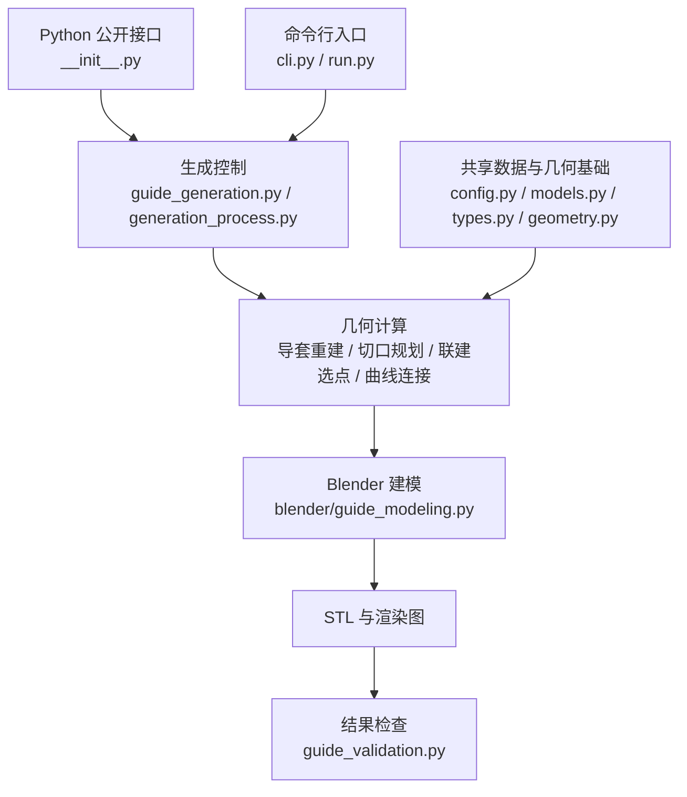

# Twinguide

Twinguide 从牙科导板 STL 和导套装配体 STL 中识别几何结构，规划导孔、
操作窗和观察窗，并建立导套与导板之间的连接结构。程序最终输出
可继续建模和检查的一体化牙科导板 STL。

## 生成过程

```text
牙科导板 STL + 导套装配体 STL
                ↓
       导套识别与参数化重建
                ↓
       导孔、操作窗和观察窗规划
                ↓
       导套侧与导板侧联建选点
                ↓
       平滑曲线连接与固定孔复切
                ↓
       布尔融合、网格清理与 STL 导出
```

## 环境与安装

使用 Python 3.13 创建虚拟环境，然后从源码安装：

```bash
python3.13 -m venv .venv
source .venv/bin/activate
python -m pip install --upgrade pip
python -m pip install .
```

开发时可使用可编辑安装，并同时安装文档依赖：

```bash
python -m pip install -e '.[docs]'
```

网格建模和渲染需要 Blender。本项目使用 Blender 5.2 LTS 开发和测试，
可从 [Blender 官方下载页](https://www.blender.org/download/) 安装。Blender 自带 Python 和 `bpy`，
不需要通过 `pip` 安装 `bpy`。

```bash
blender --version
```

macOS 上若 `blender` 不在命令搜索路径中，可使用：

```bash
/Applications/Blender.app/Contents/MacOS/Blender --version
```

## 配置与运行

[`examples/case.json`](examples/case.json) 是完整的配置示例。其中：

- `inputs.template` 指向牙科导板 STL；
- `inputs.guide_sleeve_assembly` 指向导套装配体 STL；
- `geometry` 设置导孔、连接管和体素融合参数；
- `windows` 设置窗口余量；
- `output_directory` 设置输出目录。

所有长度均以毫米为单位，相对路径相对配置文件所在目录解析。

生成牙科导板：

```bash
blender -b --python run.py -- generate --config examples/case.json
```

macOS 上若未配置 `blender` 命令，将上式中的 `blender` 替换为
`/Applications/Blender.app/Contents/MacOS/Blender`。

结果写入 `output_directory`，主模型文件为 `twin_guide.stl`。

`process` 用于查看各计算步骤的执行情况；`validate` 用于检查已导出的 STL：

```bash
blender -b --python run.py -- process --config examples/case.json

blender -b --python run.py -- validate \
  --config examples/case.json \
  --model output/twin_guide/twin_guide.stl
```

## Python 接口

```python
from pathlib import Path

from twin_guide import CaseConfig, generate_guide, validate_guide

config = CaseConfig.from_json(Path("examples/case.json"))
artifacts = generate_guide(config)
results = validate_guide(artifacts.model_path, config)
```

`generate_guide` 和 `validate_guide` 需要 Blender 提供的 Python 环境。

## 代码框架



几何计算使用数据类传递结果，不直接创建 Blender 对象。
`blender/` 负责实体化、布尔运算、网格清理、渲染和导出。

## 测试与文档

- `tests/unit/`：纯 Python 单元测试。
- `tests/blender/`：Blender 建模集成测试。
- `tests/end_to_end/`：病例端到端测试。

相关文档：

- [`ARCHITECTURE.md`](ARCHITECTURE.md)：程序架构和模块边界。
- [`PROCESS.md`](PROCESS.md)：生成顺序和各步输入输出。
- [`API.md`](API.md)：公开接口和数据类型。
- [`ALGORITHMS.md`](ALGORITHMS.md)：联建选点和曲线连接算法。

生成 Sphinx 文档：

```bash
python -m sphinx -W --keep-going -b html docs docs/_build/html
```
