# TwinGuide

TwinGuide 面向双导套牙科导板的自动化建模，负责导套几何重建、导孔与窗口规划、
结构连接、Blender 实体化、STL 导出和独立检查。

## 问题描述

已有牙科导板提供与患者牙列匹配的基体，导套装配体给出两个导套及其操作结构的
位置和尺寸。需要在不改变装配关系的前提下，在牙科导板上形成与导套同轴的导孔，
开设操作窗和观察窗，并用平滑、连通的结构将导套与牙科导板连接为一体。

完整目标还包括识别牙位、构建按压梁柱，以及根据患者牙列、牙科手机运动包络和必须保留的
功能区调整连接结构。最终模型应保持导孔、导套固定孔和窗口通畅，各结构互相连通，
并满足所需净距，输出可供后续制造和检查的一体化牙科导板 STL。

程序使用以下三个病例网格：

<table>
  <tr>
    <td width="33.3%" align="center">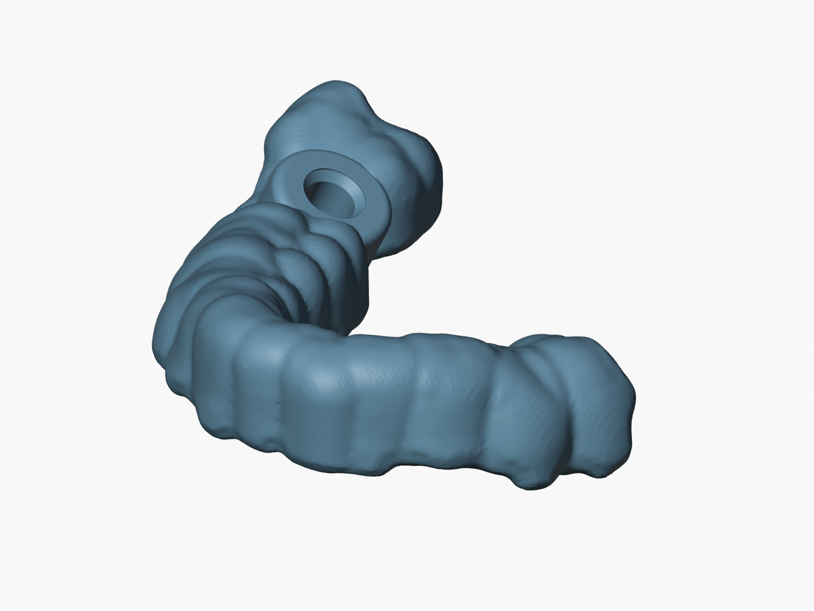</td>
    <td width="33.3%" align="center">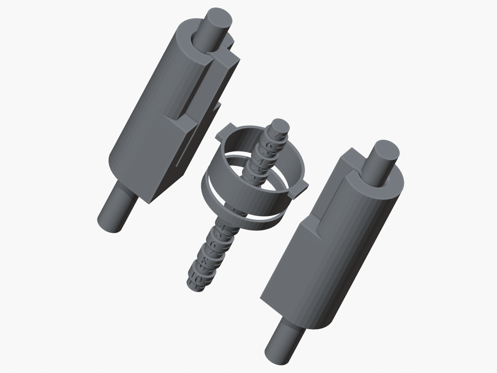</td>
    <td width="33.3%" align="center">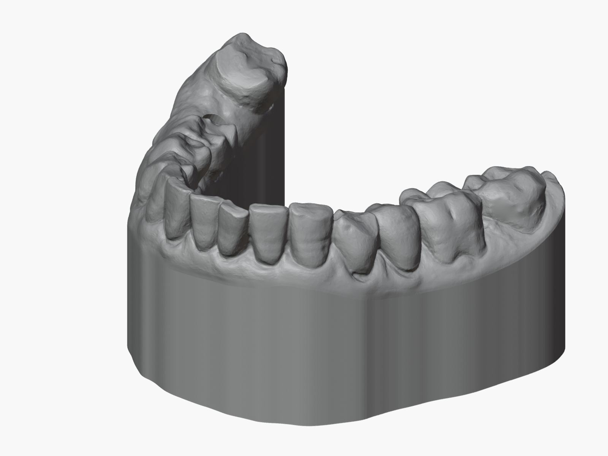</td>
  </tr>
  <tr>
    <td align="center">牙科导板</td>
    <td align="center">导套装配体</td>
    <td align="center">患者牙列扫描</td>
  </tr>
</table>

输入网格的坐标、单位和网格质量要求见使用指南中的“输入数据”页。

> **当前程序：** 程序重建两个导套，规划导孔、操作窗和观察窗，
> 为每个导套选择两个导套侧锚点和两个导板侧锚点，生成共八条曲线连接管，
> 并输出 `twin_guide.stl`。观察缺口的位置由前牙牙位确定；当前病例临时使用前牙中线的估计坐标。
> 当前缺口宽度为 7.0 mm，向导板内的切入深度为 5.5 mm。
> 牙位精细识别、
> 按压结构和净距调整仍待实现。

## 功能与结果

<table>
  <tr>
    <td width="50%" align="center">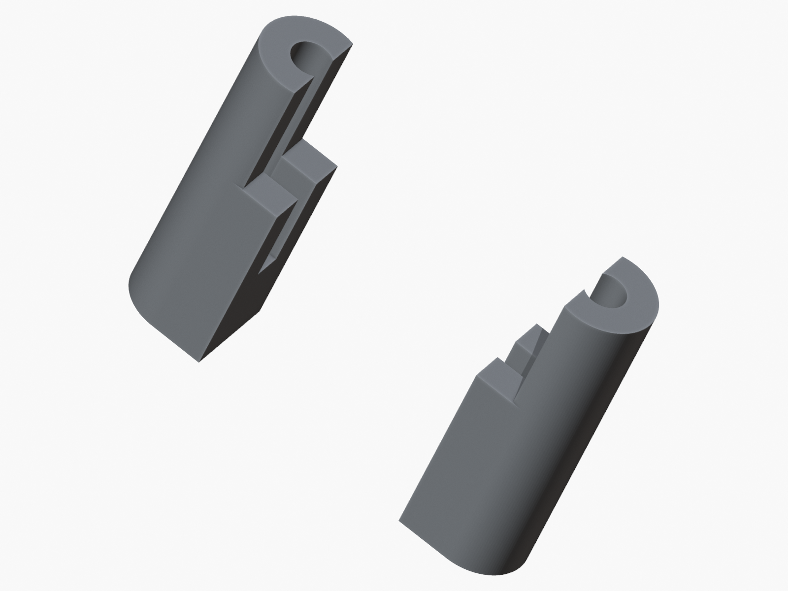</td>
    <td width="50%" align="center">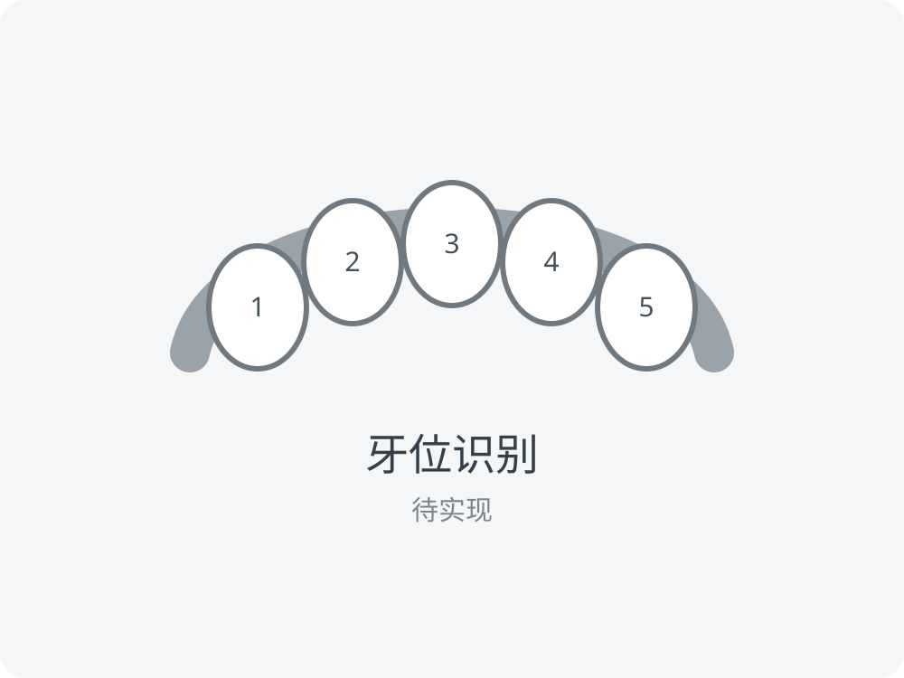</td>
  </tr>
  <tr><td align="center">1. 导套识别与参数化重建</td><td align="center">2. 牙位识别（待实现的扩展）</td></tr>
  <tr>
    <td align="center">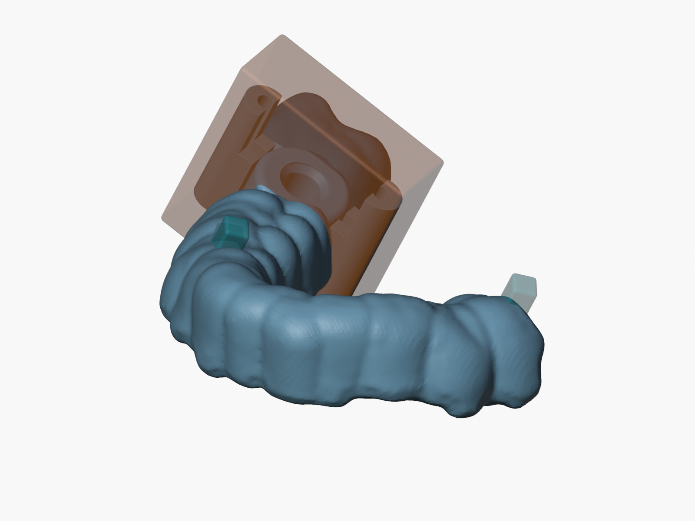</td>
    <td align="center">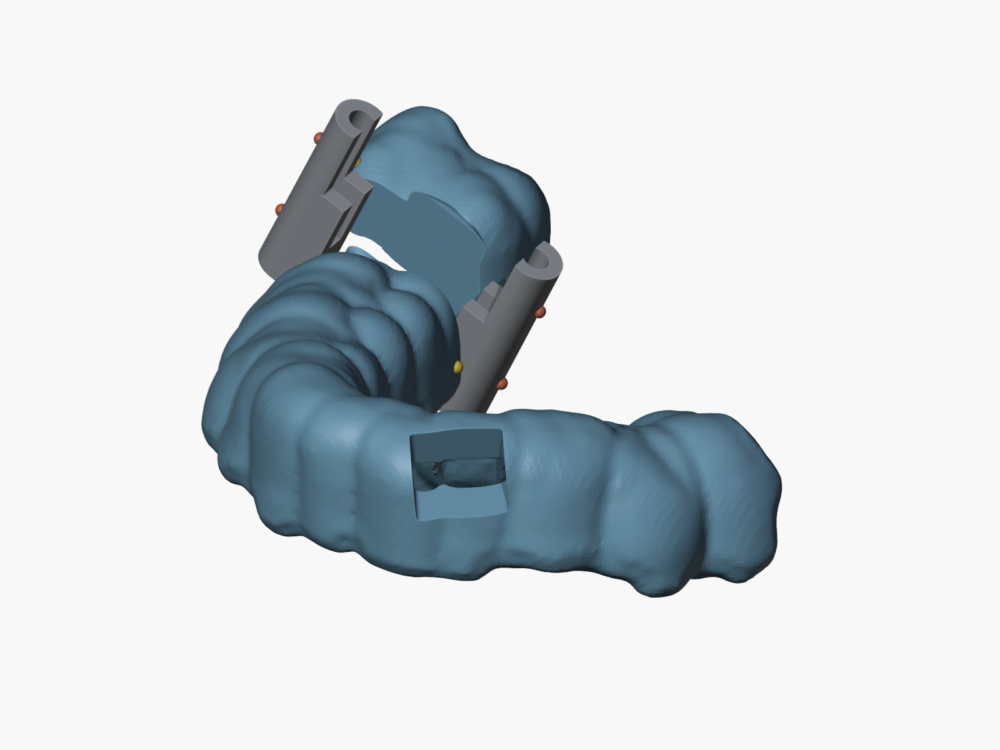</td>
  </tr>
  <tr><td align="center">3. 导孔与窗口规划</td><td align="center">4. 导套与牙科导板联建锚点选择</td></tr>
  <tr>
    <td align="center">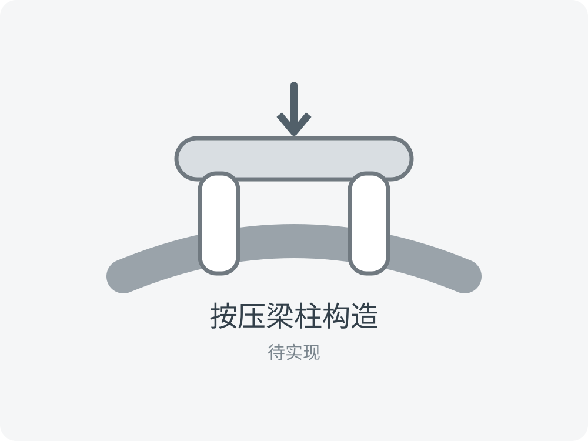</td>
    <td align="center">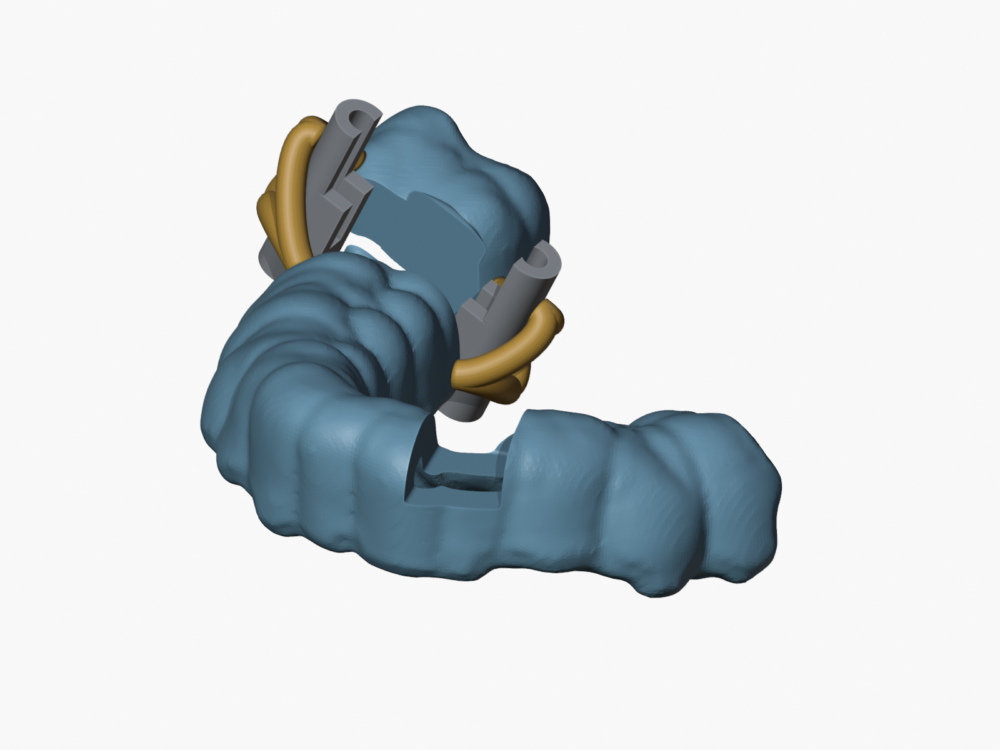</td>
  </tr>
  <tr><td align="center">5. 按压梁柱锚点选择（待实现的扩展）</td><td align="center">6. 八条光滑连接管生成与固定孔复切</td></tr>
  <tr>
    <td align="center">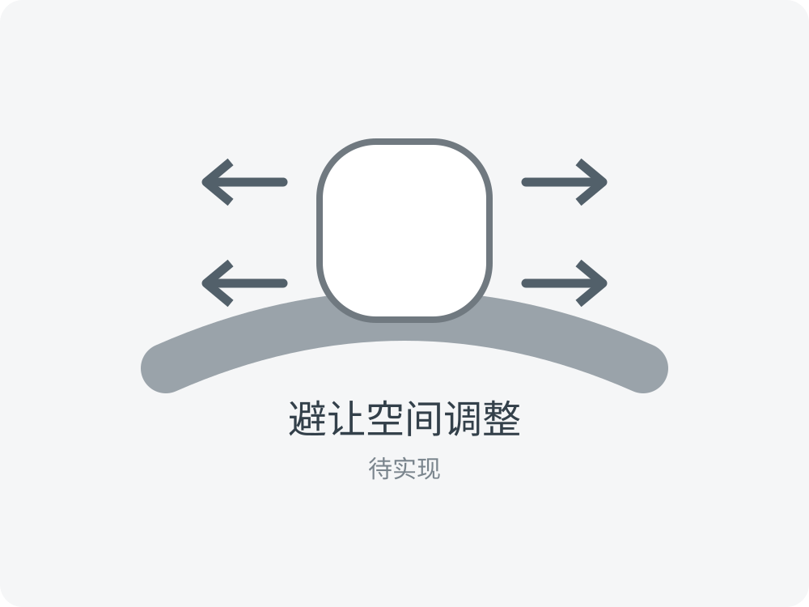</td>
    <td align="center">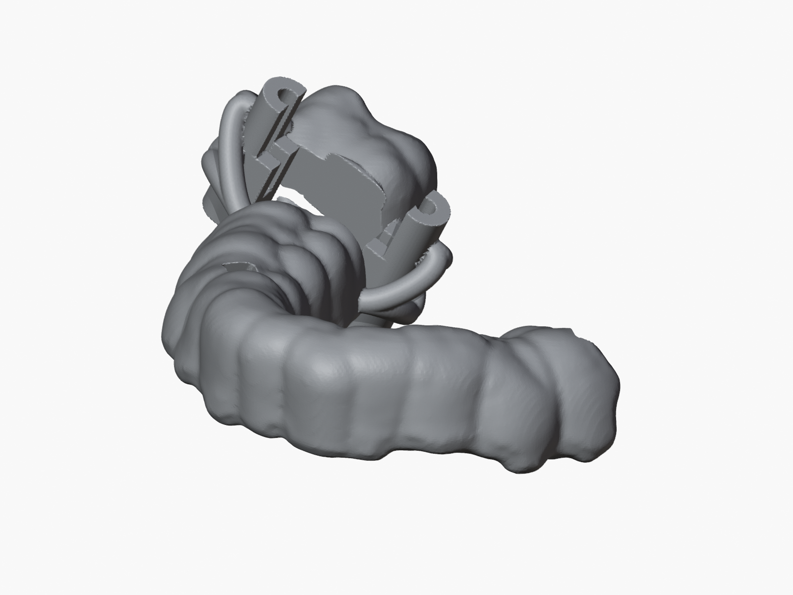</td>
  </tr>
  <tr><td align="center">7. 避让空间调整（待实现的扩展）</td><td align="center">当前版本输出的牙科导板 STL</td></tr>
</table>

## 安装与运行

TwinGuide 支持 Python 3.13–3.14，网格建模使用 Blender 5.2 LTS。
Blender 已包含 `bpy`，无需单独安装。

```bash
python3 -m venv .venv
source .venv/bin/activate
python -m pip install .

blender -b --python run.py -- generate --config examples/case.json
```

配置文件为 `examples/case.json`，生成结果写入其中指定的 `output_directory`。
当前病例的导柱内径为 2.10 mm、主体外径为 4.30 mm、连接柱直径为 2.30 mm；
完整参数见使用指南的“病例配置”页。

<!-- sphinx-homepage-end -->

## 文档

- [使用指南](https://ziyangg98.github.io/TwinGuide/guide/index.html)
- [生成过程](https://ziyangg98.github.io/TwinGuide/process/index.html)
- [程序设计](https://ziyangg98.github.io/TwinGuide/design/index.html)
- [Python API 参考](https://ziyangg98.github.io/TwinGuide/public_api.html)
