# 规范病例结果

本页固定记录当前代码已有的全病例回归结果，不是目标效果示意图。数据来自
`scripts/run_regression.py` 已生成的
`output/arch_progress_v2_all_case_regression.json`、各病例七阶段 JSON 和最终
`guide_iso.png`。本次只整理既有结果，没有重新执行全病例回归。

## 结果快照

本快照完成于 **2026-07-29 07:00（Asia/Shanghai）**，覆盖回归脚本明确列出的
8 个单种植位病例和 4 个双种植位病例：

- 12/12 个病例的回归状态为 `complete`；
- 84/84 个阶段（12 个病例 × 7 个阶段）均为 `completed`；
- 87/87 个最终 STL 验证项通过，无失败项；
- 全部最终 STL 都是单一闭合连通体，边界边、非流形边和重复三角形均为 0；
- 全部导孔探针和观察窗脊线探针的阻塞数均为 0；
- 12 个病例的标准导管表面最低保留率均为 0.9765，高于 0.90 阈值；
- 观察窗实测最小净距为 0.214–0.223 mm，高于 0.20 mm 阈值。

“检查”列表示该病例实际返回并通过的验证项数量。普通病例返回 7 项；启用两分量
桥接或远中公共节点时，会额外返回对应的条件检查。耗时为既有回归摘要记录的
`elapsed_seconds`，包含病例准备、生成和验证，不是性能承诺。

| 病例 | 标准导管 | 观察窗 | 主梁 + Y 梁 | 手机包络 | 特殊结构 | 阶段 | 检查 | 最小窗净距 | 耗时 | STL SHA-256 前缀 |
| --- | ---: | ---: | ---: | ---: | --- | ---: | ---: | ---: | ---: | --- |
| `single_11` | 2 | 2 | 4 + 3 | 2 | — | 7/7 | 7/7 | 0.221 mm | 175.2 s | `e8f429799072` |
| `single_12` | 2 | 2 | 4 + 3 | 1 | — | 7/7 | 7/7 | 0.220 mm | 131.6 s | `30da5eee2385` |
| `single_13` | 2 | 2 | 4 + 3 | 1 | 两分量同侧双梁桥接 | 7/7 | 8/8 | 0.218 mm | 168.5 s | `665eed1d1355` |
| `single_14` | 2 | 1 | 4 + 3 | 1 | — | 7/7 | 7/7 | 0.223 mm | 112.0 s | `a3dd0b499b93` |
| `single_15` | 2 | 2 | 4 + 3 | 1 | — | 7/7 | 7/7 | 0.219 mm | 125.8 s | `d83a4261ad98` |
| `single_16` | 2 | 2 | 4 + 3 | 1 | 观察窗发生局部下沉修正 | 7/7 | 7/7 | 0.214 mm | 214.8 s | `8469ac9a14fb` |
| `single_17` | 2 | 2 | 4 + 3 | 1 | 末端远中公共节点 | 7/7 | 8/8 | 0.223 mm | 130.8 s | `4fbe53b0f6b4` |
| `single_47` | 2 | 2 | 4 + 3 | 1 | 下颌三牙位按压梁 | 7/7 | 7/7 | 0.219 mm | 165.5 s | `69df9890e55d` |
| `multiple_12_13` | 4 | 2 | 4 + 3 | 2 | 双种植位连续路径 | 7/7 | 7/7 | 0.216 mm | 214.9 s | `a66804e08a60` |
| `multiple_14_15` | 4 | 2 | 4 + 3 | 2 | 双种植位连续路径 | 7/7 | 7/7 | 0.220 mm | 169.3 s | `57b569d76483` |
| `multiple_15_16` | 4 | 2 | 4 + 3 | 2 | 双种植位连续路径 | 7/7 | 7/7 | 0.216 mm | 188.3 s | `2395284a905f` |
| `multiple_16_17` | 4 | 2 | 4 + 3 | 2 | 双种植位末端公共节点 | 7/7 | 8/8 | 0.218 mm | 178.0 s | `63c7b7796cdc` |

这里的“单种植位”仍会识别并重建一对标准导管，因此对应 2 根导管和 4 根主梁；
双种植位病例从两个定位圆环生成 4 根导柱，第 6 阶段按连续路径拓扑
生成 4 根跨导管主梁，而不是为每根导管各自生成 4 根独立梁。

## 单种植位病例

| `single_11` | `single_12` |
| --- | --- |
| 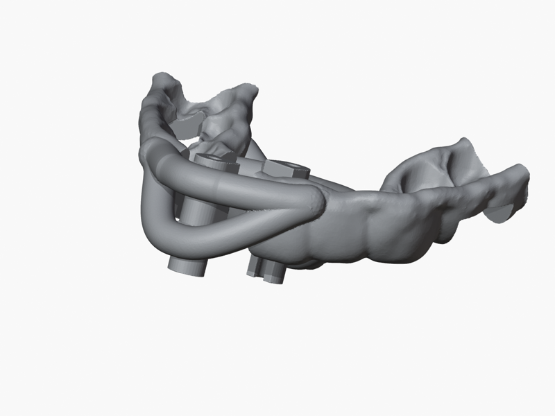 | 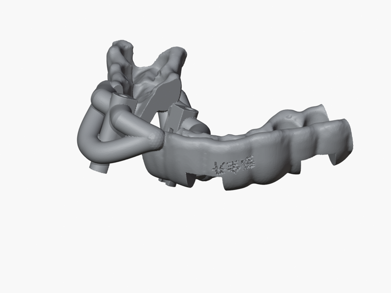 |
| `single_13`（两分量桥接） | `single_14` |
| 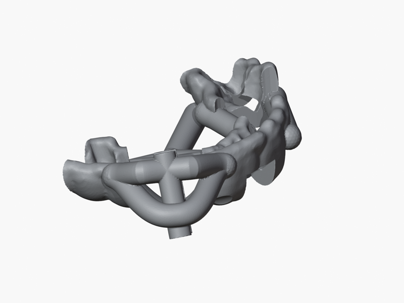 | 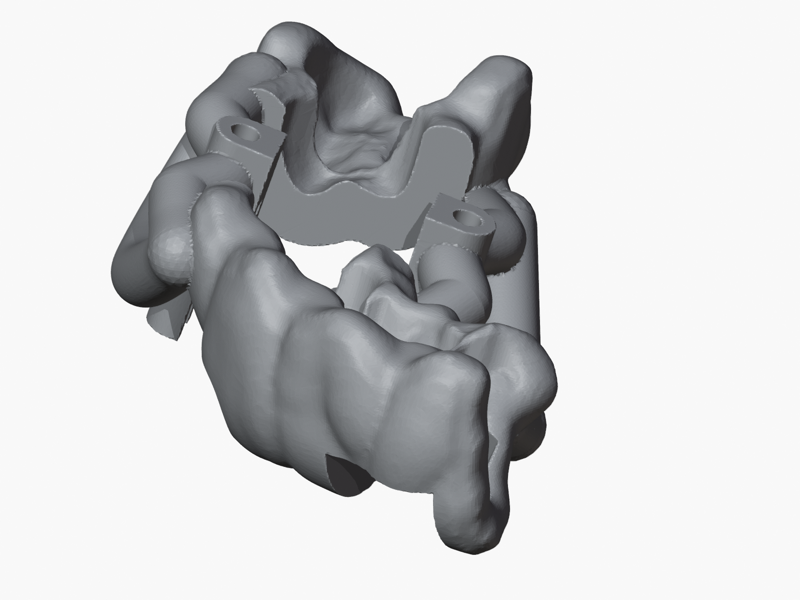 |
| `single_15` | `single_16`（观察窗局部修正） |
| 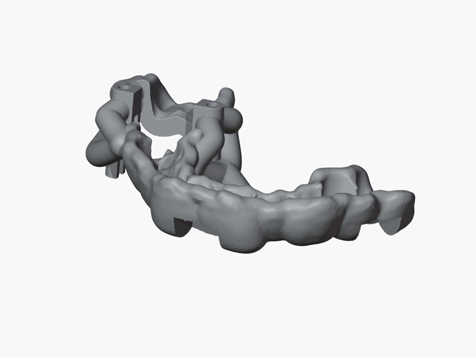 | 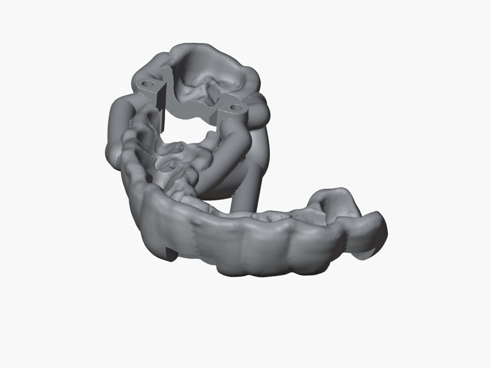 |
| `single_17`（远中公共节点） | `single_47`（下颌） |
| 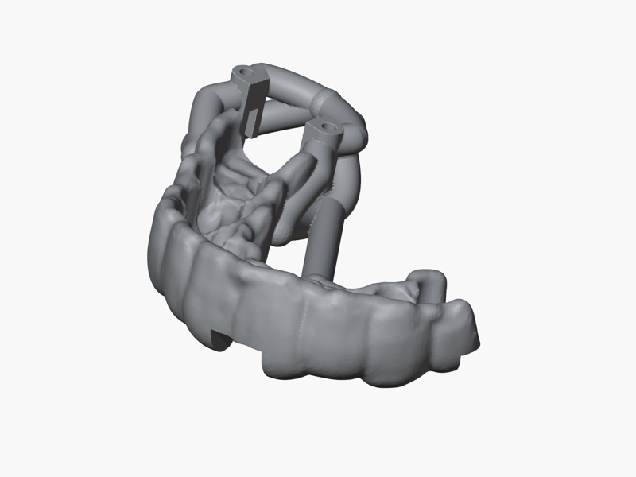 | 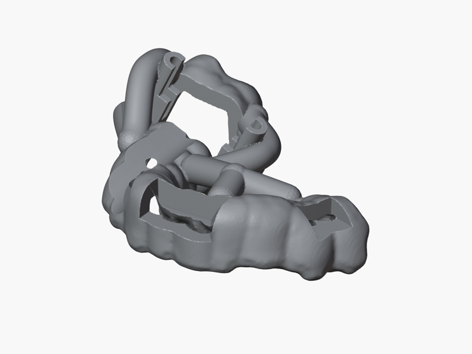 |

## 双种植位病例

| `multiple_12_13` | `multiple_14_15` |
| --- | --- |
| 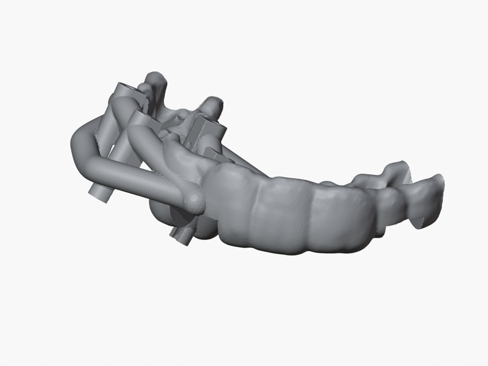 | 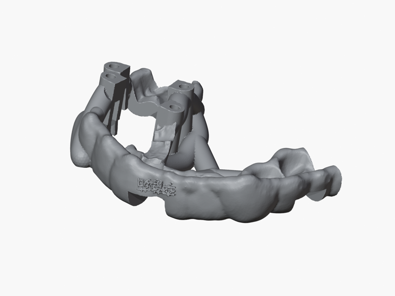 |
| `multiple_15_16` | `multiple_16_17`（远中公共节点） |
| 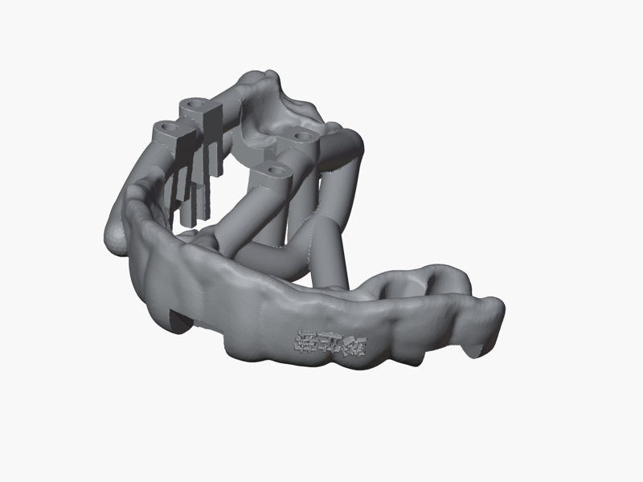 | 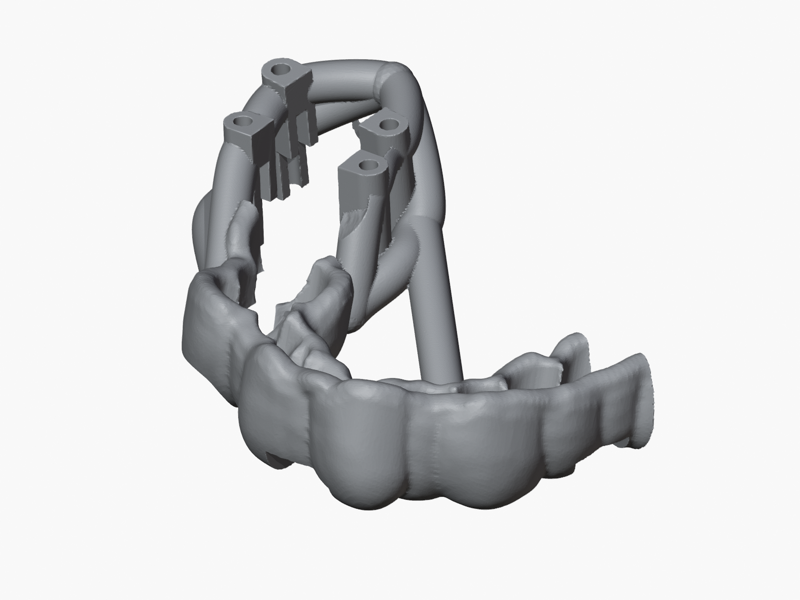 |

## 结果能说明什么

这组结果证明当前 12 个规范病例在该次快照中完成了配置所要求的七阶段计算、最终
实体化和现有验证器检查。它同时覆盖上下颌、单/双种植位、两种 Y 型按压梁、两分量
桥接、观察窗局部修正和远中公共节点。

这组结果不代表所有目标拓扑都已有正式病例覆盖。当前 12 例没有启用
`guide_terminal_u_extension`，因此末端 U 型延伸梁只有单元/后端测试和算法文档，
不能据此声称已完成全病例验证。`validate` 也不重新验证手机运动包络本身；它验证的
是包络差集之后的最终 STL。具体边界见[结果检查](validation.md)和
[特殊病例拓扑](../process/special-topologies.md)。

## 如何追溯

回归脚本对每例记录配置路径、状态、七阶段状态、最终 STL SHA-256、逐项验证指标和
分阶段耗时。阶段 JSON 则保留该次运行实际消费的输入、参数、类型化结果和质量检查。
后续结果变化时，应重新运行全病例回归并整体更新本页的时间、表格、哈希和图片，
不能只替换视觉效果较好的病例图。
