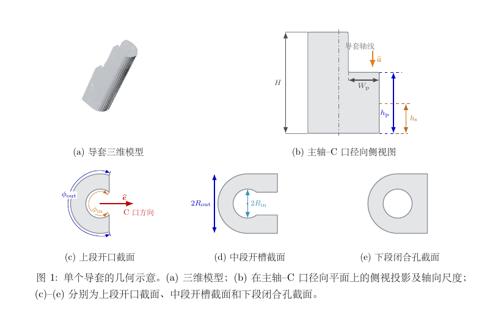

# 病例配置

`CaseConfig.from_json()` 读取 JSON 运行配置，并直接读取
`tooth_identification.case_yaml` 指向的病例 YAML。JSON 保存网格路径、
尺寸、融合和输出参数；YAML 的 `design` 保存牙位、锚点站位和
旋转角度，`planning.operation_windows` 保存病例级操作窗范围。
两者加载后在内存中按字段融合，不生成转换后的 JSON。设计字段若
同时存在于两个文件中则配置失败；操作窗参数是明确的例外，YAML
覆盖 JSON 兼容默认值。
相对路径以 JSON 配置文件所在目录为基准。

牙位识别、导板映射和观察窗实现均位于 `twin_guide` 包内部。配置只引用病例
输入数据，不引用外部 Python 脚本、历史映射程序或兄弟项目模块。

## 配置结构

| 分组 | 内容 |
| --- | --- |
| `case_id` | 病例标识符 |
| `jaw` | 上下颌：`upper` 或 `lower`；用于观察窗牙合侧定向 |
| `inputs` | 三个病例 STL 路径 |
| `sleeve` | 导柱的八个几何参数 |
| `geometry` | 导孔、连接管和体素融合参数 |
| `windows` | 操作窗兼容默认值和轴扫掠观察窗参数 |
| `tooth_identification` | 可选的统一牙位工作流 `case.yaml` |
| `handpiece_avoidance` | 可选的手机当前深度左右摆动避障参数 |
| `guide_anchors` | 可选的连接梁导板侧参数；牙位与角度推荐放在 YAML |
| `press_beam` | Y 型按压梁工程参数；模式、牙位与角度推荐放在 YAML |
| `render` | 过程图和结果图的像素尺寸 |
| `output_directory` | STL 和过程图的输出目录 |

## 完整示例

```json
{
  "case_id": "tooth_11",
  "jaw": "upper",
  "inputs": {
    "template": "../data/cases/single/tooth-11/input/guide-template.stl",
    "guide_sleeve_assembly": "../data/cases/single/tooth-11/input/sleeve-assembly.stl",
    "patient_dentition": "../data/cases/single/tooth-11/input/dentition.stl"
  },
  "sleeve": {
    "inner_diameter_mm": 2.10,
    "outer_diameter_mm": 4.3,
    "height_mm": 16.373,
    "platform_width_mm": 2.036,
    "platform_height_mm": 9.875,
    "closed_bore_height_mm": 4.777,
    "inner_arc_angle_degrees": 264.934,
    "outer_arc_angle_degrees": 211.684
  },
  "geometry": {
    "channel_axial_margin_mm": 5.0,
    "connector_diameter_mm": 4.6,
    "fusion_voxel_size_mm": 0.2,
    "connector_guide_endpoint": {
      "root_radius_factor": 1.08,
      "transition_length_mm": 3.0,
      "bulb_radius_factor": 1.08,
      "bulb_forward_offset_mm": 0.08,
      "foot_major_radius_mm": 3.0,
      "foot_minor_radius_mm": 2.2,
      "foot_peak_height_mm": 2.55,
      "foot_embed_depth_mm": 0.25
    }
  },
  "windows": {
    "operation_tangent_margin_mm": 1.0,
    "operation_bitangent_margin_mm": 3.0,
    "observation_axis_drop_mm": 0.2,
    "observation_sweep_angle_degrees": 90.0,
    "observation_local_failure_drop_targets_mm": [0.5, 1.0, 2.0],
    "observation_local_failure_transition_rows": 1
  },
  "tooth_identification": {
    "case_yaml": "../data/cases/single/tooth-11/case.yaml"
  },
  "handpiece_avoidance": [
    {
      "id": "region_1",
      "handpiece": "../data/cases/single/tooth-11/input/handpiece-01.stl",
      "stop_report": "../data/cases/single/tooth-11/input/handpiece-stop-01.json",
      "maximum_angle_degrees": 5.0,
      "pose_samples": 41,
      "union_batch_size": 7,
      "extra_clearance_mm": 0.0
    },
    {
      "id": "region_2",
      "handpiece": "../data/cases/single/tooth-11/input/handpiece-02.stl",
      "stop_report": "../data/cases/single/tooth-11/input/handpiece-stop-02.json",
      "maximum_angle_degrees": 5.0,
      "pose_samples": 41,
      "union_batch_size": 7,
      "extra_clearance_mm": 0.0
    }
  ],
  "press_beam": {
    "diameter_mm": 4.6,
    "guide_overlap_mm": 0.3,
    "junction_sleeve_distance_mm": 6.0,
    "guide_endpoint": {
      "root_radius_factor": 1.08,
      "transition_length_mm": 3.0,
      "bulb_radius_factor": 1.08,
      "bulb_forward_offset_mm": 0.08,
      "foot_major_radius_mm": 3.0,
      "foot_minor_radius_mm": 2.2,
      "foot_peak_height_mm": 2.55,
      "foot_embed_depth_mm": 0.25
    }
  },
  "render": {
    "width_px": 1600,
    "height_px": 1200
  },
  "output_directory": "../output/tooth_11"
}
```

操作窗正式在病例 YAML 中调整：

```yaml
planning:
  operation_windows:
    mode: per_implant_site
    center_mode: paired_sleeve_operation_feature
    axis_mode: paired_sleeve_average_axis
    tangent_margin_mm: 1.0
    bitangent_margin_mm: 1.5
    axial_margin_mm: 5.0
    corner_radius_mm: 1.0
    overlap_rule: union_cutters
    cut_target: guide_template_only
    sites: []
```

其中四个 `*_mm` 数值直接控制生成模型。未配置该 YAML 分组的旧病例
继续采用 JSON `windows` 中的操作窗数值；一旦配置，YAML 具有优先级。

## 导柱参数



| 参数 | 当前值 | 含义 |
| --- | ---: | --- |
| $2R_{\mathrm{in}}$ | 2.10 mm | 导柱内径 |
| $2R_{\mathrm{out}}$ | 4.30 mm | 导柱主体外径 |
| $H$ | 16.373 mm | 导柱总高度 |
| $W_{\mathrm p}$ | 2.036 mm | 平台径向长度 |
| $h_{\mathrm p}$ | 9.875 mm | 平台段高度 |
| $h_{\mathrm s}$ | 4.777 mm | 闭合孔段高度 |
| $\phi_{\mathrm{in}}$ | 264.934° | 内圆弧覆盖角 |
| $\phi_{\mathrm{out}}$ | 211.684° | 主体外圆弧覆盖角 |
| 连接梁直径 | 4.60 mm | 导管与导板之间的连接梁默认直径；字段可省略 |

`sleeve` 集中定义导柱的八个标量尺寸，`geometry.connector_diameter_mm`
定义连接柱直径。两个 C 口分别指向对侧导柱。
角度在配置中使用度，建模时转换为弧度。

`geometry.connector_guide_endpoint` 控制四根连接梁的导板端强化。高、低梁
虽然共有 8 个梁端，但复用同一组 A/S 点，因此只在 4 个唯一导板接触位置
生成根部球和贴合脚；每根梁本身仍在左右端各自完成 3 mm 平滑渐粗。

## 观察窗约定

配置 `tooth_identification` 时，第 2 步从 `case.yaml` 读取人工牙位集合、
确认方向、口扫和导板路径，现场执行统一牙位识别与导板映射。识别、映射、
输入 SHA-256 和算法清单均写入本次 TwinGuide 输出目录。第 3 步直接消费
本次运行的内存结果，并在同一输出目录内生成组合 cutter；配置不再引用历史
映射或开口报告。

未在 YAML 人工指定三条方向轴时，左右候选除牙冠语义评分外还必须通过
缺失牙—导管手术位一致性检查。程序读取 `objects.sleeve` 的激活 STL，比较
缺失牙预测位置到导管中心的牙弓平面距离；最近候选需不超过 15 mm，且比
另一候选至少近 3 mm，否则停止病例。选择依据和两方向距离写入
`coordinate_system.missing_to_surgical_site_consistency`。

全局高度固定为 0.2 mm、扫掠角为 90°。完整 QA 失败时，只对失败轴行
依次尝试 0.5、1.0、2.0 mm 的有效高度；通过即停止，全部失败时保留
2.0 mm 最后一次结果和失败标记。未配置牙位映射时不生成观察窗，且不再
回退到无 FDI 语义的 7.0 mm 矩形缺口。

`handpiece_avoidance` 启用第 7 步；可以是单个对象，也可以是带唯一 `id` 的
对象数组。`handpiece` 是当前装配位姿的手机 STL，
`stop_report` 必须包含 `pair_axis`、候选止挡面以及左右匹配结果。默认只做
当前深度下 `-5°～+5°` 左右扫掠，41 个奇数姿态确保包含 0°；不做轴向下压，
也不保护梁架。多个手机分别生成包络，并按配置顺序从最终导板依次切除。
`extra_clearance_mm` 默认 0，表示直接使用精确运动包络。
各几何参数的算法含义见对应的[生成步骤](../process/index.md)。

## YAML 导管实体模式

`case.yaml` 的 `design.sleeve_geometry.mode` 决定最终导管实体来源：

```yaml
design:
  sleeve_geometry:
    mode: input  # 或 generated
```

- `generated`：默认兼容模式。按 JSON 的 `sleeve` 尺寸和识别位姿重建标准导管；
  导板整体融合后复切导孔，并执行旧版最大连通体清理。
- `input`：直接采用输入装配体中识别出的导管实体。连接锚点投射到真实导管表面；
  连通组件必须在拟合轴线上具有可通行孔道，实心导孔占位 cutter 不参与导管
  配对；验证报告记录源组件编号和轴向孔道通过率。
  所有导板切割先完成，输入导管最后融合，之后不再全局复切导孔或执行
  “只留最大连通体”。低位连接梁只嵌入真实外壁 1.45 mm，不再采用依赖
  后续全局复切的全直径深埋。输入导管加入前，导孔切割体只复切导板和
  连接梁基础体，以删除连接梁侵入导孔的部分。因此输入实体自身的孔腔和开口
  会原样保留。最终只清除体积小于 0.25 个融合体素的离散数值碎片，这不等价于
  “只留最大连通体”；若输入导管
  本身没有真实孔腔，验证会明确报告通道不通过，不会自动钻孔改变输入实体。

未配置 `sleeve_geometry` 时使用 `generated`，保证旧病例行为不变。

## YAML 锚点设计

`case.yaml` 的 `design.guide_anchors` 定义连接梁的导板端拓扑：
常规 `tooth_section_trajectory` 使用两个端部、每端各一个 U 侧和背 U 侧
独立锚点，末端缺牙 `terminal_distal_common_node` 使用一个近中端部和一个远中自由公共
节点。相邻两个末端种植位使用
`adjacent_two_implant_terminal_distal_node_paths`：一个近中端部的
U/背 U 两个锚点分别经过两个种植位的对应导管，最后汇合到同一个
远中节点。`design.press_beam` 定义 Y 梁模式、牙位站位和各站位的
射线角度。例如：

```yaml
design:
  guide_anchors:
    mode: tooth_section_trajectory
    anchors:
      - {id: station_1_u, endpoint: station_1, side: u_side, station: {type: tooth_center, fdi: 48}, ray_angle_degrees: 70.0}
      - {id: station_1_back_u, endpoint: station_1, side: back_u_side, station: {type: tooth_center, fdi: 48}, ray_angle_degrees: 90.0}
      - {id: station_2_u, endpoint: station_2, side: u_side, station: {type: tooth_pair_midpoint, fdis: [46, 45]}, ray_angle_degrees: 70.0}
      - {id: station_2_back_u, endpoint: station_2, side: back_u_side, station: {type: tooth_pair_midpoint, fdis: [46, 45]}, ray_angle_degrees: 90.0}

  press_beam:
    mode: three_tooth_anchors_y
    stations:
      - {type: tooth_pair_midpoint, fdis: [45, 44], ray_angle_degrees: 75.0}
      - {type: tooth_pair_midpoint, fdis: [31, 32], ray_angle_degrees: 45.0}
      - {type: tooth_pair_midpoint, fdis: [34, 35], ray_angle_degrees: 75.0}

  guide_terminal_u_extension:
    enabled: true
    mode: tooth_wrapping_u_beam
    anchor_station: {type: tooth_center, fdi: 21}
    u_side_ray_angle_degrees: 70.0
    back_u_side_ray_angle_degrees: 90.0
    terminal_fdi: 23
    reference_neighbor_fdi: 22
    diameter_mm: 4.60
    dental_clearance_mm: 0.20
    safety_margin_mm: 0.30
    turnaround_depth_mm: 3.00
    endpoint_reinforcement:
      enabled: true
      method: bulb_and_conformal_foot
```

末端缺牙且远中无导板覆盖时，可配置：

```yaml
design:
  guide_anchors:
    mode: terminal_distal_common_node
    u_side_ray_angle_degrees: 70.0
    back_u_side_ray_angle_degrees: 90.0
    stations:
      - {type: tooth_pair_midpoint, fdis: [16, 15]}
    terminal_distal_common_node:
      missing_fdi: 17
      reference_neighbor_fdi: 16
      node_radius_factor: 1.12
      distal_offset_sleeve_diameters: 2.0
```

该模式以两导管下端 P 锚点中点 `B` 作为轴向基准，沿同时垂直于
两导管中心连线和公共轴线的远中方向固定平移两个平均导管外径，
直接得到 `G`。不再进行牙龈投射或其他高度调整。四根主连接梁共享该节点。此模式与
`guide_terminal_u_extension` 互斥。

相邻两个末端缺牙种植位配置为：

```yaml
design:
  guide_anchors:
    mode: adjacent_two_implant_terminal_distal_node_paths
    stations:
      - id: s_mesial
        type: tooth_pair_midpoint
        fdis: [15, 14]
        u_side_ray_angle_degrees: 70.0
        back_u_side_ray_angle_degrees: 90.0
    terminal_distal_common_node:
      missing_fdi: 17
      reference_neighbor_fdi: 15
      implant_fdis: [16, 17]
      node_radius_factor: 1.12
      distal_offset_sleeve_diameters: 2.0
```

此模式要求导管装配体按 `implant_fdis` 的近中到远中顺序输入。公共节点
只使用远中种植位（上例为 17）的两根导管下端 P 中点作为平移基准。
最终形成 U 侧/背 U 侧各一条跨两个种植位的连续路径，并分别生成上下
两层，共四根梁汇合到同一远中自由节点。

JSON 中的 `press_beam` 可以只保留 `diameter_mm`、`guide_overlap_mm`、
`junction_axial_lift_mm` 和 `guide_endpoint` 等工程字段。

`guide_terminal_u_extension` 用于初始导板末端覆盖较短、但只需要外围梁架
延伸的病例。`anchor_station` 在已有导板上用 U/背 U 双射线取得两个根部，
`reference_neighbor_fdi → terminal_fdi` 定义远中方向。回转位置优先读取牙位
识别保存的末端牙独立闭合轮廓；梁中心线相对轮廓外扩“梁半径＋牙体净距＋
安全余量”，在轮廓远中侧以切向连续曲线连接两侧梁。两端可复用
`bulb_and_conformal_foot` 根部强化。`turnaround_depth_mm` 表示两侧圆弧入口
到远中回转顶点的曲率深度，包含在上述中心线外扩范围内，不会再次叠加到
牙体净距；因此回转端梁表面目标间隙为
`dental_clearance_mm + safety_margin_mm`。

## 按压梁约定

`press_beam.mode` 默认为 `disabled`。设为 `inner_sleeve_upper_y` 时必须提供
两个牙位站位及各自的 `ray_angle_degrees`；每个站位可以是单牙中心
`tooth_center` 或双牙中点 `tooth_pair_midpoint`。程序不接受导管编号，
而是以最近牙位的局部牙弓外向坐标自动
选择更偏腭/舌侧的内导管，并复用其靠近导板顶部的 `upper Q/P`。两导管的
内外侧坐标差不足 0.50 mm 时安全失败，不猜测导管。`diameter_mm` 默认
4.60 mm，`guide_overlap_mm` 默认 0.30 mm。该参数仍独立于连接梁配置，
但当前两者默认值相同。`junction_sleeve_distance_mm` 默认 6.00 mm，表示
Y 汇合点中心到内侧导管 `upper P` 中心的最小距离。若 `upper P` 在导管
正轴向上不低于三锚点几何中位点，程序使用 `upper P` 等高平面；若它低于
原中心，则不再下拉汇合点，而从原中心沿导管正轴向抬高
`junction_axial_lift_mm`（默认 2.00 mm）。过近时只调整径向位置以满足
6.00 mm 下限，不改变上述目标轴向高度。三臂夹角下限由
`minimum_junction_angle_degrees` 设置，默认 25°。多种植位导管候选策略
由 `sleeve_anchor_selection` 明确记录；当前支持每个种植位先取内侧高端，
再以到两个导板锚点的 maximin 距离评分、总距离作为平局规则。

设为 `terminal_u_extension_anchor_y` 时，Y 梁包含一个末端 U 型延伸梁锚点
和两个显式角度牙位锚点。程序在 `segment` 指定的 `u_side`、
`back_u_side`、`turnaround` 或 `full` 中心线上，分别排除起点
`start_margin_mm` 和终点 `end_margin_mm` 后，最大化候选点到两个牙位导板
锚点距离的较小值；即采用
`farthest_from_guide_anchors` 的 maximin 最远点，不再使用参考牙位最近点。
圆管表面锚点自动朝向另外两个牙位锚点；Y 梁中心线再沿该表面法向向延伸梁
内部预埋 `overlap_mm`，因此不在延伸梁上生成导板贴合脚。

两个导板端默认采用增强融合根：最后 3.00 mm 以 smoothstep 从梁半径
2.30 mm 渐粗至 2.484 mm，叠加半径 2.484 mm 的根部球，并生成主/次半径
3.00/2.20 mm 的曲面贴合椭圆脚。贴合脚顶部高度 2.55 mm、向导板内预埋
0.25 mm；这些参数均可在 `press_beam.guide_endpoint` 中覆盖。导管端不应用
该增强结构，继续复用内侧导管 `upper P` 的既有连接。
若配置足印在局部高曲率表面的投影距离超过 1.56 mm，程序会以 2% 步长
等比例缩小主、次半径，采用首个通过值；缩到 77% 仍不通过时记录运行警告
和对象超限属性，并采用 77% 足印继续生成 STL，交由最终质量检查和人工复核。
两个导板锚点直接采用指定角度的 U 侧射线外壁出口，不再生成轨迹候选、
20%/80% 定位或自动组合评分。

设为 `three_tooth_anchors_y` 时必须提供三个牙位站位及各自角度；每个站位
同样可以独立使用 `tooth_center` 或 `tooth_pair_midpoint`。三个梁端均位于
导板 U 形内侧外表面。汇合点以三个中心线锚点的算术中心为基准，
沿病例 YAML 确认的牙合轴 `coordinate_system.e_occ` 抬高
`junction_axial_lift_mm`，默认 2.00 mm；字段名为兼容既有病例保留。
该模式不使用导管平均轴向或 `junction_sleeve_distance_mm`。
