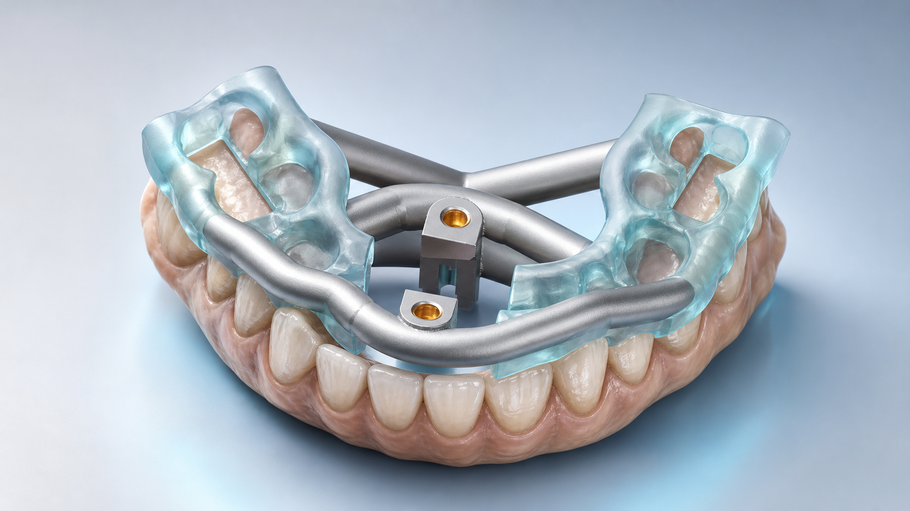

# TwinGuide 文档

TwinGuide 从牙科导板、导管装配体和患者牙列网格出发，依次完成导管
识别、牙位映射、窗口规划、锚点选择、按压梁、结构连接和器械避让，
最终导出一体化 STL 并执行独立验证。



使用者从[使用指南](guide/index.md)开始；流程责任见[生成过程](process/index.md)，
模块边界见[程序设计](design/index.md)，稳定调用方式见
[Python API 参考](public_api.rst)。

第 1 阶段已有稳定实现；第 2–7 阶段在完整 Blender 和 12 病例回归重新
通过前继续标记为实验状态。

```{toctree}
:hidden:
:maxdepth: 2

guide/index
process/index
design/index
public_api
stage_reference
backend
```
