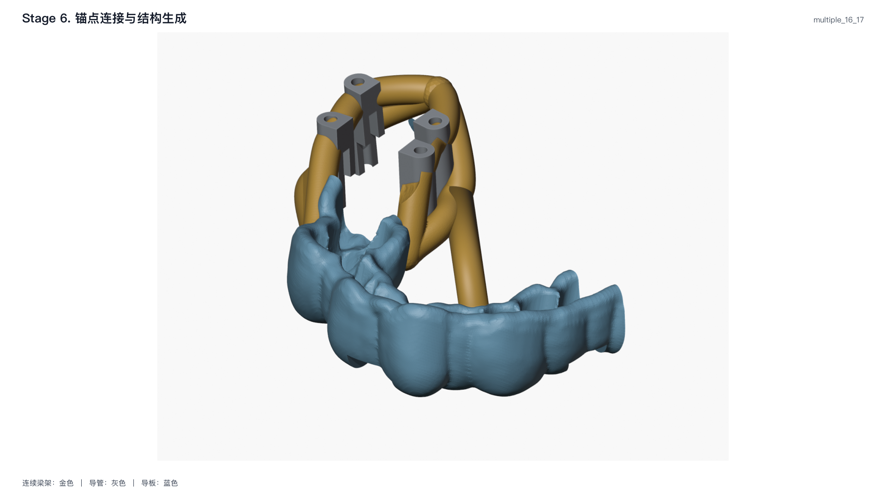

# 特殊病例拓扑

特殊病例不使用另一条建模管线。它们在第 4–6 阶段产生明确的锚点、
端点语义或附加路径，然后与普通主梁一起实体化。配置字段见
{doc}`../guide/configuration`。

## 两分量导板的同侧双梁桥接

### 适用条件

原始导板恰好包含两个需要连为一体的主连通分量。启用
`design.guide_component_bridge` 后，第 4 阶段在两个牙位站位分别寻找
U 侧和背 U 侧导板锚点。

### 选点与分配

设站位 $i\in\{1,2\}$ 在两个导板分量上的射线出口为 $A_{i,c}^{s}$，
其中 $c\in\{1,2\}$ 是导板分量，$s\in\{U,\bar U\}$ 是侧别。程序比较
两种跨分量分配，并使射线总距离最小：

$$
\pi^*=\arg\min_{\pi\in\{(1,2),(2,1)\}}
\sum_{s\in\{U,\bar U\}}
\left(d_{1,\pi_1}^{s}+d_{2,\pi_2}^{s}\right).
$$

当 `require_different_guide_components: true` 时，两站位必须落在不同分量。
第 6 阶段按侧别构造两条桥接路径：

```text
A1,U     → A2,U
A1,back  → A2,back
```

梁径由 `diameter_mm` 决定；可选的 `bulb_and_conformal_foot` 在导板端增加球头和贴合脚。
分量数不是 2、站位数不是 2、射线无有效外壁出口，或无法形成跨分量分配时应明确失败，
不猜测三个以上碎片的连接顺序。

## 末端有牙时的 U 型延伸梁

### 适用条件

末端牙存在，但原导板覆盖过短，需要从导板两侧绕末端牙延伸支撑。
`terminal_fdi` 和 `reference_neighbor_fdi` 必须同象限、直接相邻，
前者必须是该象限实际存在的最远端牙。

### 方向和净距

将“参考邻牙中心 $T_r$ → 末端牙中心 $T_t$”投影到牙合平面，得到远中单位方向：

$$
\mathbf e_d=
\frac{(\mathbf T_t-\mathbf T_r)-[(\mathbf T_t-\mathbf T_r)\cdot\mathbf e_{occ}]\mathbf e_{occ}}
{\left\|(\mathbf T_t-\mathbf T_r)-[(\mathbf T_t-\mathbf T_r)\cdot\mathbf e_{occ}]\mathbf e_{occ}\right\|}.
$$

U 型中心线到牙面的计划距离为

$$
d_{center}=r_{beam}+d_{clearance}+d_{safety}.
$$

因此梁表面的计划牙面净距是 $d_{clearance}+d_{safety}$。默认值为
$0.20+0.30=0.50$ mm。`turnaround_depth_mm` 控制回转曲线形状。

回转端优先使用独立闭合牙冠轮廓估计远中和左右包络；无法取得可靠轮廓时，
才使用局部牙列网格包络。两侧路径使用五次 Hermite 曲线，以各自局部切向进入和离开回转段。

牙列 STL 可能同时包含牙龈，因此验证不能用整条 U 梁到整张网格的全局最小距离代替牙冠净距；
应分别检查规划牙冠轮廓、远中方向、回转点和中心线保留率。

## 末端缺牙时的远中公共节点

### 适用条件

末端种植位远中没有导板覆盖，四根主梁应闭合到远中自由节点，而不是向不存在的
导板或牙龈表面发射射线。

### 节点几何

设末端两根导管的低端梁中心点为 $P_1^L,P_2^L$，基点为

$$
\mathbf B=\frac{\mathbf P_1^L+\mathbf P_2^L}{2}.
$$

远中单位方向 $\mathbf e_d$ 先由两导管中心连线与公共导管轴的叉积产生两个候选，
再用“参考邻牙→缺失末端牙槽位”的 FDI 方向确定符号。设两根导管平均外径为 $D$，
公共节点为

$$
\mathbf G=\mathbf B+2D\,\mathbf e_d.
$$

$\mathbf G$ 和 $\mathbf B$ 保持相同导管轴向高度。这一模式不向牙龈/牙列网格发射射线，
不执行根方下压、表面法向偏移或最大投射距离计算。端点来源使用明确的
`DISTAL_COMMON_NODE` 语义，不伪装成导板三角面索引。

对两个相邻末端种植位，`adjacent_two_implant_terminal_distal_node_paths`
使用如下每侧路径：

```text
S_mesial,U     → P16,U     → P17,U     → G
S_mesial,back  → P16,back  → P17,back  → G
```

高端和低端分别构造一次，因此仍然是四根主梁。节点基点必须取最远中种植位两根导管
低端 P 点中点，不能使用全部导管的总体中心。由于牙列 STL 可能包含牙龈，
实体化时只对“远中导管 P → 公共节点 G”的闭合段使用特定保护；
近中导板段和种植位之间的其他连接梁仍执行牙列净距修剪。



*multiple-16-17 完整运行的第 6 阶段结果。四根标准导管保持逐装配体识别，金色路径按牙弓顺序经过两个末端种植位并在远中公共节点闭合。*

## 模式互斥与组合

`guide_terminal_u_extension` 和 `guide_anchors.terminal_distal_common_node` 互斥：

- 末端牙存在时，绕牙生成 U 型支撑；
- 末端牙缺失时，四根梁闭合到远中自由节点。

`terminal_u_extension_anchor_y` 按压梁只能在启用 U 型延伸时使用。
两分量桥接可以与普通主梁和按压梁并存，但其站位与分量身份必须独立通过质量检查。

## 特殊拓扑的输出与验证

- 第 4 阶段 JSON 记录特殊导板锚点、分量归属或远中公共节点；
- 第 6 阶段 JSON/PNG 记录桥接梁、U 型路径或共节点路径；
- 最终验证分别检查跨分量连接、U 型根部/回转/净距、四梁共节点和受保护闭合段；
- `generate --validate` 在最终 STL 上检查特殊结构的实体保留情况。
