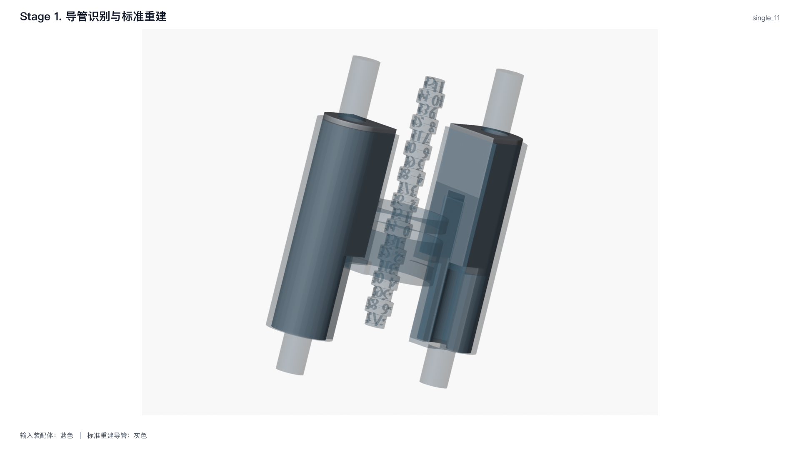

# 1. 导管识别与标准重建

**实现状态：稳定。** 本阶段对每个种植位的导管装配体独立执行：

```text
连通分量分析 → 七点导孔资格 → 候选对排序 → 精确轴向符号
→ C 口相向 → 八参数标准重建
```

输入网格只决定位姿和操作结构；最终导管始终由标准参数重建。

## 输入、输出与符号

| 符号 | 含义 |
| --- | --- |
| $M_k$ | 装配体的第 $k$ 个连通分量 |
| $\mathbf{x}_{ki}$ | $M_k$ 的第 $i$ 个表面采样点 |
| $\mathbf{c}_k$ | 候选中心 |
| $\mathbf{p}_k$ | 内孔拟合轴原点 |
| $\mathbf{a}_k$ | 有符号的单位导管轴 |
| $[z_k^-,z_k^+]$ | 候选沿 $\mathbf a_k$ 的真实轴向范围 |
| $L_0,R_0$ | YAML 中的标准高度和外半径 |
| $\mathbf e_{\mathrm{occ}}$ | 病例已确认的牙合外向 |

输入是 `SleeveGenerationInputs`；输出 `SleeveGenerationResult`
包含当前种植位的两根 `GuideSleeve` 和导板局部标架。多种植位由
`analyze_case()` 逐装配体调用同一算法，不跨装配体配对。

## 1. 单分量分析

候选中心和 PCA 轴为

$$
\mathbf c_k=\frac1{n_k}\sum_{i=1}^{n_k}\mathbf x_{ki},\qquad
\mathbf u_k=\operatorname*{arg\,max}_{\|\mathbf u\|=1}
\sum_i\bigl[(\mathbf x_{ki}-\mathbf c_k)\cdot\mathbf u\bigr]^2.
$$

对每个点计算轴向坐标和径向距离

$$
t_{ki}=(\mathbf x_{ki}-\mathbf c_k)\cdot\mathbf u_k,\qquad
\rho_{ki}=\left\|(\mathbf x_{ki}-\mathbf c_k)-t_{ki}\mathbf u_k\right\|.
$$

PCA 高度 $L_k=\max_i t_{ki}-\min_i t_{ki}$，外半径代理值取
$R_k=Q_{0.90}(\rho_{ki})$。这两个量只用于候选排序，不是最终位姿。

内孔拟合只执行一次，得到精确无符号轴 $(\mathbf p_k,\mathbf a_k)$ 和
真实轴向范围：

$$
z_{ki}=(\mathbf v_{ki}-\mathbf p_k)\cdot\mathbf a_k,\qquad
z_k^-=\min_i z_{ki},\qquad z_k^+=\max_i z_{ki}.
$$

## 2. 七点真实导孔资格

固定探测分数集为

$$
F=\{0.15,0.25,0.35,0.50,0.65,0.75,0.85\}.
$$

第 $f$ 个轴心探测点为

$$
\mathbf q_{kf}=\mathbf p_k+\bigl[z_k^-+f(z_k^+-z_k^-)\bigr]\mathbf a_k.
$$

令 $I(M_k,\mathbf q)=1$ 表示点在实体内。清空探测数为

$$
C_k=\sum_{f\in F}\bigl[1-I(M_k,\mathbf q_{kf})\bigr].
$$

导管候选资格是

$$
\operatorname{has\_axial\_bore}(M_k)\iff C_k\ge5.
$$

因此实心切除体在轴心上的探测点位于实体内，会自然失去资格；
不需要“实心切除体分类器”。

## 3. 候选对的确定性排序

对所有合格候选对 $(i,j)$，按以下键的字典序取最小：

$$
K_{ij}=\left(
D_{ij}^{\mathrm{size}},
D_{ij}^{\mathrm{axis}},
-\|\mathbf c_i-\mathbf c_j\|,
i,j
\right),
$$

其中

$$
D_{ij}^{\mathrm{size}}=
\frac{|L_i-L_0|+|L_j-L_0|}{L_0}
+\frac{|R_i-R_0|+|R_j-R_0|}{R_0},
$$

$$
D_{ij}^{\mathrm{axis}}=1-|\mathbf u_i\cdot\mathbf u_j|.
$$

优先级是标准尺寸、平行度、更大的两分量间距，最后才是组件索引。
组件索引只负责在几何完全相同时给出确定性结果。

## 4. 轴向符号和 C 口方向

拟合直线无固有正负。程序直接使用已知牙合外向统一符号：

$$
\mathbf a_k\leftarrow
\begin{cases}
\mathbf a_k,&\mathbf a_k\cdot\mathbf e_{\mathrm{occ}}\le0,\\
-\mathbf a_k,&\mathbf a_k\cdot\mathbf e_{\mathrm{occ}}>0.
\end{cases}
$$

轴原点平移到牙合外向一端：

$$
\mathbf p_k\leftarrow\mathbf p_k+
\min_i\bigl[(\mathbf v_{ki}-\mathbf p_k)\cdot\mathbf a_k\bigr]\mathbf a_k.
$$

选中导管 $i$ 指向对侧导管 $j$ 的 C 口单位方向为

$$
\mathbf d_i^C=
\frac{(\mathbf c_j-\mathbf c_i)-
[(\mathbf c_j-\mathbf c_i)\cdot\mathbf a_i]\mathbf a_i}
{\left\|(\mathbf c_j-\mathbf c_i)-
[(\mathbf c_j-\mathbf c_i)\cdot\mathbf a_i]\mathbf a_i\right\|}.
$$

该定义使两个 C 口相向，并直接复用已经拟合的轴线。

## 5. 导板局部标架

令 $\mathbf n$ 为导板主平面法向，以
$\mathbf n\cdot\mathbf e_{\mathrm{occ}}\ge0$ 统一符号。两导管中点为
$\mathbf m=(\mathbf c_i+\mathbf c_j)/2$，导板中心为 $\mathbf c_T$，则

$$
\mathbf e_d=\operatorname{unit}\!\left[
(\mathbf c_T-\mathbf m)-((\mathbf c_T-\mathbf m)\cdot\mathbf n)\mathbf n
\right],
$$

$$
\mathbf e_l=\operatorname{unit}(\mathbf e_d\times\mathbf n).
$$

`TemplateFrame` 为 $(\mathbf c_T,\mathbf e_l,\mathbf e_d,\mathbf n)$。投影向量退化时直接
报错，不使用世界 X/Y 轴替代。

## 6. 八参数标准重建

每根导管复用 $(\mathbf p_k,\mathbf a_k,\mathbf d_k^C)$，几何由下列参数唯一定义：

$$
\Theta_k=(H,h_p,h_c,w_p,r_i,r_o,\alpha_i,\alpha_o).
$$

它们依次是总高、平台高度、闭合导孔高度、平台宽度、内外半径以及
内外 C 口圆弧角。角度从 YAML 度数转为弧度：

$$
\alpha^{\mathrm{rad}}=\alpha^{\circ}\pi/180.
$$

最终 `GuideSleeve` 轴向范围固定为 $[0,H]$。输入导管外壁不复制到最终模型；
第 4 阶段锚点和最终导孔复切都使用同一份 $\Theta_k$。

## 质量检查与失败条件

- 每个分量至少有 20 个表面采样点；
- 内孔拟合轴向范围 $z_k^+-z_k^->10^{-6}$ mm；
- 合格导孔候选至少有两个；
- 导板局部深度方向非零；
- 八参数必须构成封闭、壁厚为正的导管；
- 多种植位的每个装配体必须独立产生恰好两根导管。

组件索引和 $C_k/7$ 只进入内部拒绝原因，不进入对外 `GuideSleeve`。

## 代码对应

| 文档算法 | 当前代码入口 |
| --- | --- |
| 连通分量 PCA、内孔轴和七点资格 | `sleeve_generation._analyze_component`、`_filter_bore_candidates` |
| 精确内孔轴拟合 | `sleeve_estimation.sleeve.estimate_sleeve_axis` |
| 候选对排序与轴向定号 | `sleeve_generation._select_pair`、`_orient_axis_against_occlusal` |
| C 口方向与导板标架 | `sleeve_estimation.sleeve.c_opening_toward`、`sleeve_generation._template_frame` |
| 八参数校验和标准重建 | `blender.sleeve_reconstruction.validate_sleeve_boolean_parameters`、`create_closed_sleeve_object` |

## 输出文件与结果图

- `stage-01-sleeve-reconstruction.json`：轴、C 口、标准尺寸和阶段质量检查；
- `stage-01-sleeve-reconstruction.png`：输入装配体与标准重建导管的实际对照。



*tooth-11 完整运行的第 1 阶段结果。蓝色是实际输入装配体，灰色是复用识别位姿的八参数标准重建导管。*
