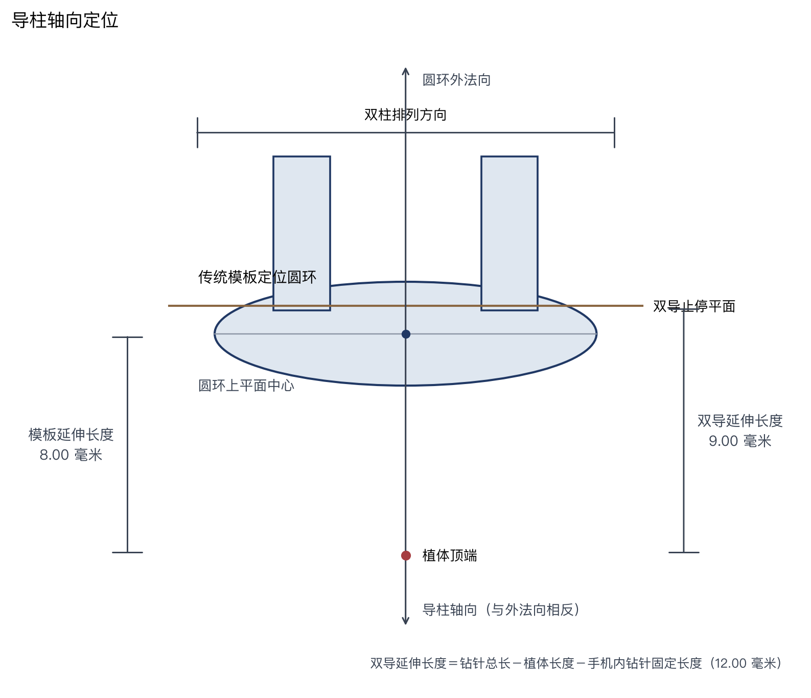
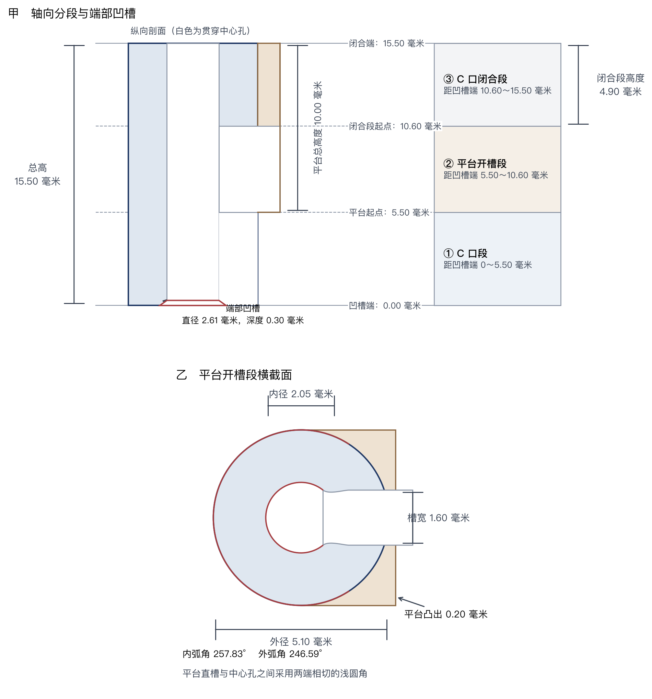
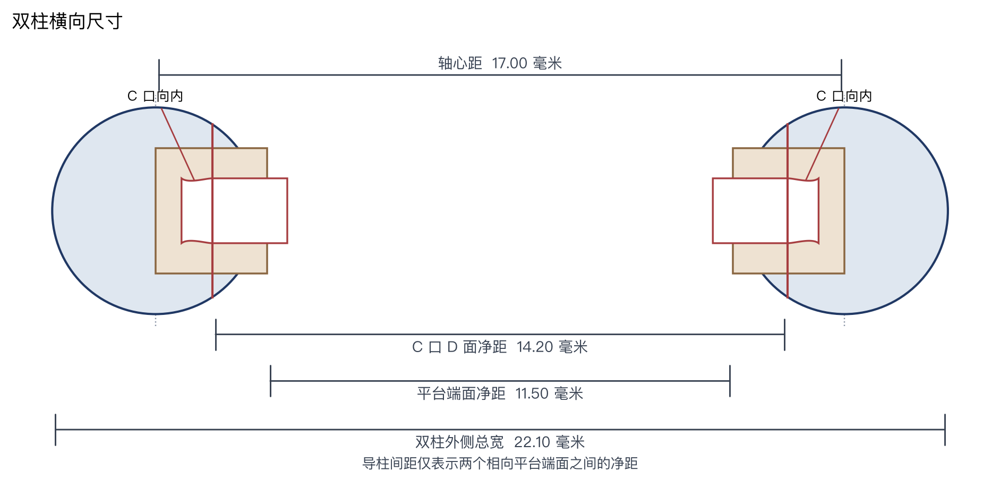
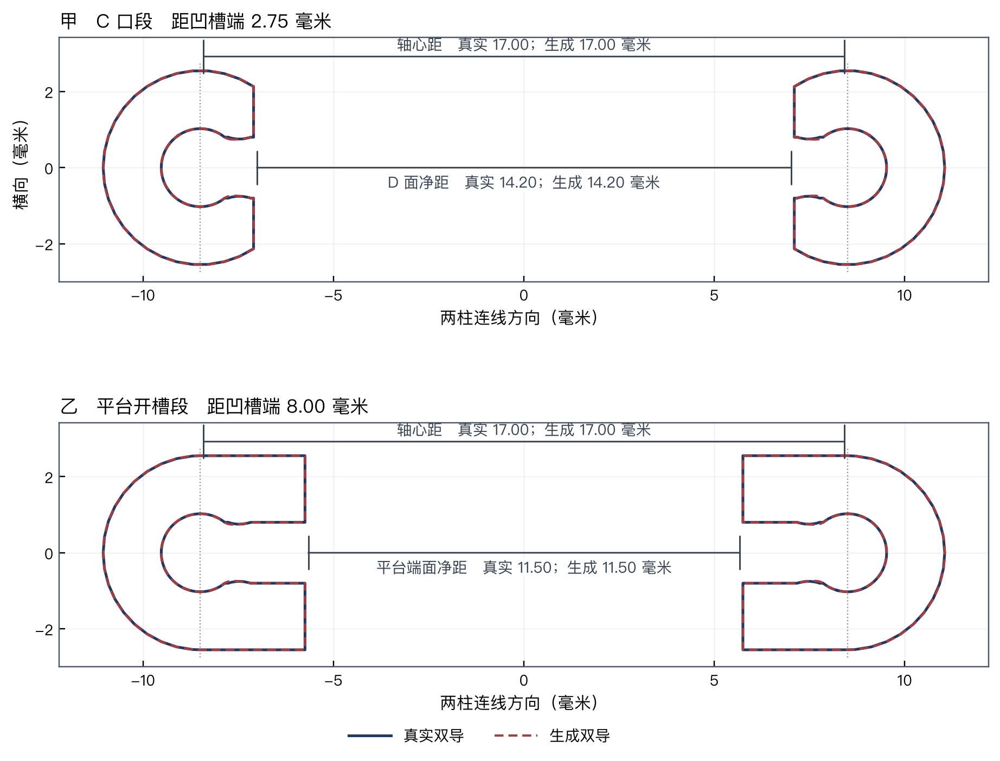
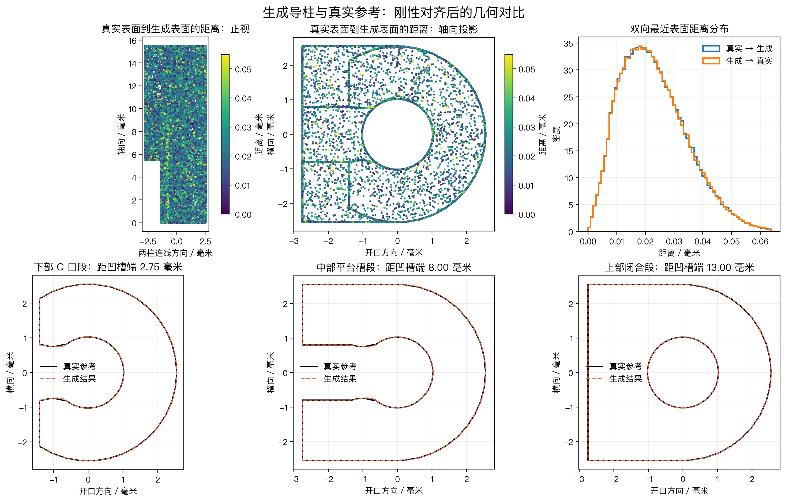

# 1. 从传统模板生成双导导柱

第 1 阶段从传统模板的定位圆环恢复每个种植位的轴线和止停位置，再根据病例参数直接
生成左右相向的一对导柱。程序不读取现成导柱装配体；真实导柱 STL 只用于生成结果的
几何对比。

## 生成输入与结果

每个 `planning.guide_posts` 对应一个定位圆环和一个种植位置。程序对每个种植位依次：

1. 拟合圆环上平面，确定导柱轴、植体顶端和双导止停平面；
2. 将全局标准参数与该种植位的三项高度覆盖合并；
3. 用合并后的参数生成一根导柱的三个轴向区段；
4. 按平台端面净距复制并相向放置左右两根导柱。

输出中，一个种植位固定对应两根 `GuideSleeve`。同一种植位的左右导柱共用完整的
12 项最终参数。不同种植位只允许总高、平台总高度和 C 口闭合段高度不同；
其余 9 项形状与间距参数使用全局标准值。

## 1. 确定导柱位置



圆环上平面给出中心、外法向和种植轴。`sleeve_template_extension_mm` 表示圆环上平面
到植体顶端的轴向距离。双导延长量由钻针长度和植体长度计算：

$$
L_{\mathrm{twin}}=L_{\mathrm{drill}}-12-L_{\mathrm{implant}}.
$$

其中 12 mm 是钻针位于手机内部的固定长度，不随病例或种植位置变化。牙弓在该圆环处
的局部法向决定左右导柱的
排列方向，两根导柱的 C 口均朝向中间。

模板延伸长度和双导延伸长度相互独立，不要求相等：前者由
`sleeve_template_extension_mm` 直接配置，后者由钻针与植体长度计算。双导止停平面
相对圆环上平面的外法向偏移等于“双导延伸长度减模板延伸长度”。本图采用 8.00 mm 的
模板延伸长度和 9.00 mm 的双导延伸长度，因此双导止停平面位于圆环上平面外侧
1.00 mm；其他种植位置会按各自数值分别绘制和生成。

## 2. 设置标准参数和种植位参数

### 全局标准值

`runtime.sleeve` 保存真实标准导柱的默认参数。长度单位为 mm，角度单位为度。

```yaml
runtime:
  sleeve:
    inner_diameter_mm: 2.05
    outer_diameter_mm: 5.10
    top_recess_diameter_mm: 2.61
    top_recess_depth_mm: 0.30
    height_mm: 15.50
    platform_slot_width_mm: 1.60
    platform_overhang_mm: 0.20
    platform_height_mm: 10.00
    closed_bore_height_mm: 4.90
    inner_arc_angle_degrees: 257.83
    outer_arc_angle_degrees: 246.59
    guide_spacing_mm: 11.50
```

### 每个种植位的三项高度覆盖

种植位的 `sleeve` 只接受 `height_mm`、`platform_height_mm` 和
`closed_bore_height_mm`。未填写的高度继承 `runtime.sleeve`。下面的圆环 1
使用 16.00 mm 总高、10.50 mm 平台总高度和 5.00 mm C 口闭合段高度；
其余 9 项参数使用全局标准值。

```yaml
planning:
  guide_posts:
    - ring_index: 1
      drill_length_mm: 33.00
      implant_length_mm: 12.00
      sleeve_template_extension_mm: 8.00
      sleeve:
        height_mm: 16.00
        platform_height_mm: 10.50
        closed_bore_height_mm: 5.00
```

参数生效顺序为：全局标准值 → 种植位 `sleeve` 覆盖值 → Blender 中该种植位的
三项高度调整。Blender 高度控制以种植位为单位，左右导柱同步变化。

### 12 项参数定义

| 参数 | 标准值 | 几何定义 | 种植位调整 |
| --- | ---: | --- | --- |
| `inner_diameter_mm` | 2.05 | 贯穿整根导柱的中心导孔直径 | 否 |
| `outer_diameter_mm` | 5.10 | 不包含平台凸出部分的圆柱主体外径 | 否 |
| `top_recess_diameter_mm` | 2.61 | 凹槽端同轴环形凹槽的最大直径 | 否 |
| `top_recess_depth_mm` | 0.30 | 环形凹槽沿导柱轴向进入实体的深度 | 否 |
| `height_mm` | 15.50 | 凹槽端到闭合端的导柱轴向总高 | 是 |
| `platform_slot_width_mm` | 1.60 | 平台开槽段中央直槽的宽度 | 否 |
| `platform_overhang_mm` | 0.20 | 内侧平台端面超出圆柱主体外缘的距离 | 否 |
| `platform_height_mm` | 10.00 | 平台从闭合端向凹槽端延伸的轴向总高度 | 是 |
| `closed_bore_height_mm` | 4.90 | 从闭合端起算的 C 口闭合段高度；中心导孔仍贯通 | 是 |
| `inner_arc_angle_degrees` | 257.83 | C 口段中心导孔保留圆弧的圆心角 | 否 |
| `outer_arc_angle_degrees` | 246.59 | C 口段主体外轮廓保留圆弧的圆心角 | 否 |
| `guide_spacing_mm` | 11.50 | 左右导柱相向内侧平台端面之间的净距 | 否 |

只有 `height_mm`、`platform_height_mm` 和 `closed_bore_height_mm` 可按种植位覆盖，
且同一种植位左右两根共用合并后的值。其余 9 项只使用全局标准值，所有种植位共用该值。三项高度必须满足
`0 < closed_bore_height_mm < platform_height_mm < height_mm`。中心导孔保留圆弧角必须在
180° 至 350° 之间，以保持 C 口形态并可靠离散圆滑过渡。

## 3. 生成单根导柱



导柱局部轴向从凹槽端 $z=0$ 指向闭合端 $z=H$。总高 $H$、平台总高度 $P$ 和
C 口闭合段高度 $C$ 决定三个连续区段：

| 轴向范围 | 区段 | 截面 |
| --- | --- | --- |
| $0\le z<H-P$ | C 口段 | 中心孔向内侧开放，端面带环形凹槽 |
| $H-P\le z<H-C$ | 平台开槽段 | 带平台，中央直槽与中心孔圆滑相接 |
| $H-C\le z\le H$ | C 口闭合段 | C 口闭合，中心导孔继续贯通 |

实体按圆柱主体、平台、贯穿中心孔、端部凹槽、C 口和平台槽的顺序构造。平台槽不是
直槽与圆孔的尖角拼接：程序使用浅圆角曲线连接两者，圆角起点沿中心孔圆周切线进入，
终点以水平切线接入中央直槽，因此两个连接端均无切向折角。

## 4. 放置同一种植位的左右导柱



`guide_spacing_mm` 只表示两相向内侧平台端面之间的净距。设外半径为 $R$、平台凸出量
为 $e$、平台端面净距为 $g_p$，则双柱轴心距为：

$$
d_a=g_p+2(R+e).
$$

标准参数对应的平台端面净距为 11.50 mm、轴心距为 17.00 mm、双柱外侧总宽为
22.10 mm、C 口 D 面净距为 14.20 mm。外径、平台凸出量、外弧角和平台端面
净距都是全局共用参数，因此上述双柱横向尺寸在同一份配置的所有种植位一致。

## 5. 生成与真实导柱对比

真实双导和生成双导先分别恢复共同轴向与两柱连线方向，再以完整双柱的轴心中点进行
刚性对齐。对齐过程只施加同一个整体刚性变换，不分别移动左右导柱，因此会保留并显露
真实的双柱间距差异：



对齐结果中，真实与生成的轴心距均为 17.00 mm，平台端面净距均为 11.50 mm，
C 口段 D 面净距均为 14.20 mm；图中实线与虚线基本重合。单柱局部形状继续按同一
共用坐标系比较：



图中直接比较整体轮廓、端部凹槽、C 口、平台和圆滑平台槽。该图使用
`runtime.sleeve` 中的真实标准参数，不使用种植位局部覆盖。

## 技术附录

设圆环上平面中心为 $\mathbf c_r$，外法向为 $\mathbf a$，导柱轴向
$\mathbf u=-\mathbf a$，双柱排列方向为 $\mathbf p$。植体顶端与止停平面中心为：

$$
\mathbf c_i=\mathbf c_r-L_{\mathrm{template}}\mathbf a,
\qquad
\mathbf c_s=\mathbf c_i+L_{\mathrm{twin}}\mathbf a.
$$

单柱局部原点中点及左右轴心为：

$$
\mathbf c_0=\mathbf c_s-(H-P)\mathbf u,
\qquad
\mathbf c_{L/R}=\mathbf c_0\mp\frac{d_a}{2}\mathbf p.
$$

C 口 D 面净距由外弧角 $\theta_o$ 派生：

$$
g_c=d_a-2R\cos\left(\frac{360^\circ-\theta_o}{2}\right).
$$

## 代码对应

对应实现位于 `case_analysis.py`、`blender/sleeve_reconstruction.py` 和
`sleeve_estimation/c_opening.py`。三张参数图由
`scripts/draw_guide_parameter_definitions.py` 读取病例 YAML 生成；真实对齐图由
`scripts/compare_aligned_guide_geometry.py` 生成；该脚本同时输出完整双柱间距叠加图和
单柱局部形状图。
