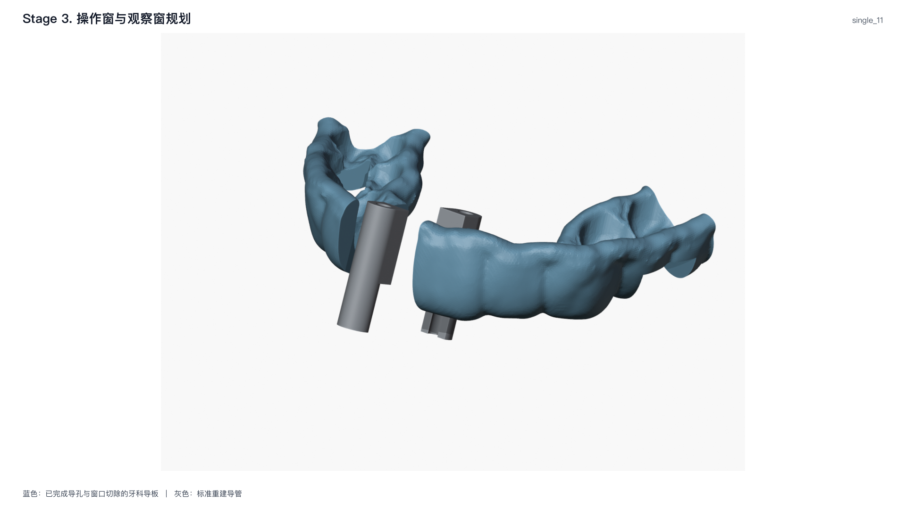

# 3. 导孔与窗口规划

**实现状态：实验。** 本阶段把第 1 步的导管位姿和第 2 步的 FDI
牙位映射转换为 `CutoutPlan`。导孔和操作窗是解析几何；轴扫观察窗会用
trimesh/manifold3d 生成 PLY 切除体，并先在导板副本上完成真实差集质量检查，
通过后才把文件型 `ProfileWindowCutout` 交给 Blender。

## 输入与输出

| 输入 | 作用 |
| --- | --- |
| `CaseAnalysis` | 导板表面采样、每个种植位的两根导管和操作结构 |
| `SleeveGenerationResult` | 按各种植位最终有效参数重建的导柱及其位姿 |
| `ToothIdentificationResult` | 已通过质量检查的 FDI 观察窗区间、牙弓局部方向和语义轴 |

`CutoutPlan` 固定包含三类结果：

- `channels`：每根导管一个圆柱导孔；
- `windows`：每个种植位一个圆角矩形操作窗；
- `profile_windows`：全部 FDI 轴扫观察窗合并成的一个切除体。

公开输出为 `stage-03-cutout-planning.json/.png`。PNG 显示实际导板完成
导孔和窗口差集后的中间结果。

## 1. 导孔

对导管 `i`，识别中心为 `C_i`，单位轴为 `a_i`，识别轴向范围为
`[z_min, z_max]`，轴向余量为 `m`。导孔圆柱为：

$$
\mathbf s_i=\mathbf C_i+(z_i^- -m)\mathbf a_i,\qquad
\mathbf e_i=\mathbf C_i+(z_i^+ +m)\mathbf a_i,\qquad
r_i=r_{\mathrm{inner}}.
$$

因此导孔始终沿第 1 步已确定的精确导管轴，不从导板或 Blender
网格再拟合一次。

## 2. 操作窗

每个种植位只使用该定位圆环生成的两根导柱。先将两轴调整到同向后取平均轴
`n`；两导管中心连线在 `n` 法平面内的投影为长边方向 `t`，
`n × t` 为短边方向。

令 $\Delta\mathbf C=\mathbf C_2-\mathbf C_1$，先与源码一致定义

$$
\widetilde{\mathbf a}_2=
\begin{cases}
\mathbf a_2,&\mathbf a_1\cdot\mathbf a_2\ge0,\\
-\mathbf a_2,&\mathbf a_1\cdot\mathbf a_2<0,
\end{cases}
\qquad
\mathbf n=\operatorname{unit}(\mathbf a_1+\widetilde{\mathbf a}_2).
$$

$$
\mathbf t=\operatorname{unit}\left[
\Delta\mathbf C-(\Delta\mathbf C\cdot\mathbf n)\mathbf n
\right],\qquad
\mathbf b=\operatorname{unit}(\mathbf n\times\mathbf t).
$$

宽、高为

$$
W=|\Delta\mathbf C\cdot\mathbf t|+R_1+R_2+2m_t,
$$

$$
H=d_{\mathrm{operation}}+2m_b,
$$

其中 $m_t,m_b$ 分别是长边和短边余量。竖向不再用局部厚度极差
围绕 $\mathbf C_o$ 对称放置，而是直接求完整上下边界。局部导板采样集为

$$
\mathcal S=\left\{\mathbf x:
|(\mathbf x-\mathbf C_o)\cdot\mathbf t|\le W/2+2,
\ |(\mathbf x-\mathbf C_o)\cdot\mathbf b|\le H/2+2
\right\}.
$$

再把局部导板采样点以及左右导柱的轴向上下端点合并为集合 $\mathcal Q$，并定义

$$
z_-=\min_{\mathbf x\in\mathcal Q}(\mathbf x-\mathbf C_o)\cdot\mathbf n-m_r,
\qquad
z_+=\max_{\mathbf x\in\mathcal Q}(\mathbf x-\mathbf C_o)\cdot\mathbf n+m_f,
$$

其中 $m_f,m_r$ 分别是前、后轴向余量。最终切割体为

$$
D=z_+-z_-,
\qquad
\mathbf C_{\mathrm{window}}=\mathbf C_o+\frac{z_-+z_+}{2}\mathbf n.
$$

因此操作窗在第一次规划时就完整覆盖局部导板和两根导柱的竖向范围，
即使导板内外表面相对圆环中心不对称，也不会在一侧留下未切除材料。

## 3. FDI 轴扫观察窗

观察窗只有一种实现：

```text
读取第 2 步已批准的 FDI 语义轴
→ 沿轴均匀取截面
→ 每个截面从牙合向外侧扫过配置角度
→ 从导板外部向语义轴发射射线
→ 以真实外壁交点加径向余量构造封闭切除体
```

射线支撑的完整性条件见下文。

对某个观察窗，第 2 阶段给出语义轴端点 $\mathbf g_0,\mathbf g_1$、
牙合零度方向 $\mathbf e_0$ 和外侧 $90^\circ$ 方向 $\mathbf e_{90}$。第 $r$ 个轴行为

$$
\mathbf g_r=(1-\lambda_r)\mathbf g_0+\lambda_r\mathbf g_1
-\delta_r\mathbf e_0,\qquad
\lambda_r=\frac{r}{N_r-1}.
$$

扫掠角 $\theta_c$ 对应单位径向

$$
\mathbf d_c=\cos\theta_c\,\mathbf e_0+
\sin\theta_c\,\mathbf e_{90},\qquad
\theta_c\in[\theta_{min},\theta_{max}],
$$

其中配置总扫掠角为 $\Theta\in(0,180^\circ]$，代码使用

$$
\theta_{min}=-\max(0,\Theta-90^\circ),
\qquad
\theta_{max}=\min(\Theta,90^\circ).
$$

因此前 $90^\circ$ 优先分配给牙合到牙弓外侧，只在 $\Theta>90^\circ$
时向牙弓内侧扩展。

从导板外部沿 $-\mathbf d_c$ 发射射线，得沿 $\mathbf d_c$ 方向最外层的真实外壁径向距离
$\rho_{rc}$。径向过切量 $m_r$ 由
`runtime.windows.observation_solver.wall_overcut_mm` 配置，外层采样点为

$$
\mathbf y_{rc}=\mathbf g_r+(\rho_{rc}+m_r)\mathbf d_c.
$$

每个相邻 $(r,c)$ 网格单元与轴心内侧核心点构成闭合凸体，全部单元并集即
为组合切除体。

对射线半径网格 $\rho_{rc}$，代码接受两种与实现一致的支撑条件：

$$
\frac{\#\{(r,c):\rho_{rc}\text{ 有真实命中}\}}
{N_rN_c}\ge0.75
\quad\text{且每行至少一个命中},
$$

或者，有命中的轴行构成一个连续区间，且该区间每行在外侧末两个角度列
都有真实命中。只有满足其中一种时，缺失单元才反复使用上下左右有限邻居的
中位数补齐；无邻居可填时直接失败。

## 4. 约束求解与质量检查

算法先沿每个轴行和观察角计算导板外壁与首次牙面交点，再求满足牙面可见行比例的
最小统一内切深度。切除体由外壁、
反向内弧、两侧边界和两端封口直接组成一个封闭网格。

内切深度不得超过观察窗高度。可见牙面行数不足或所需深度超限时，阶段直接报告
需要值和允许值，不生成切除体。

生成后同时检查：

- 每个窗的轴截面完整，射线支撑连续；
- 语义轴已被完整打开；牙面可见行比例和连续通道比例达到配置下限；
- 组合切除体和差集结果均为封闭体；
- 差集主体、最小移除体积和残留交叠均按 `observation_solver` 的对应阈值检查；
- 实际移除体积、源网格与切除体交集体积满足布尔体积恒等式；
  两次独立网格布尔取配置的绝对与相对误差上限中的较大者；
- 结果与切除体没有超过容差的残留重叠。

全部默认值只在[病例配置](../guide/configuration.md#runtimewindows)维护。

## 缓存边界

第 3 阶段的可再生成文件统一位于：

```text
output/<case_id>/.cache/stage-03-cutout-planning/
├── manifest.json
├── observation-window-cutter.ply
├── observation-window-report.json
└── raw-overview.png
```

后续阶段通过内存中的 `CutoutPlan` 读取本阶段结果。

## tooth-11 示例结果

下表记录 tooth-11 生成结果中的主要数值。

| 项目 | 结果 |
| --- | --- |
| 导孔 | 2 |
| 操作窗 | 1 |
| FDI 观察窗 | `right`、`left` |
| 每窗离散 | 14 个轴截面 × 31 个角度点 |
| 最小已移除轴净距 | `right` 0.203 mm；`left` 0.201 mm |
| 牙面可见行比例 | 1.0 |
| 连续通道比例 | 1.0 |
| 约束求解 | 牙面引导内切边界，一次生成 |

## 代码对应

| 文档算法 | 当前代码入口 |
| --- | --- |
| 导孔与操作窗解析几何 | `window_cutouts._plan_channels`、`_plan_operation_window` |
| 轴扫契约与固定参数 | `observation_window_opening.build_observation_window_opening` |
| 射线网格、补值和切除体 | `observation_window_engine._core.build_axis_sweep_cutter` |
| 差集质量门 | `observation_window_engine._core._run_once` |
| 最小可行内切深度 | `observation_window_engine._core.build_axis_sweep_cutter` |



*tooth-11 完整运行的第 3 阶段实际切除结果。蓝色为已切除导孔、操作窗和 FDI 轴扫观察窗的导板，灰色为标准导管参照。*
