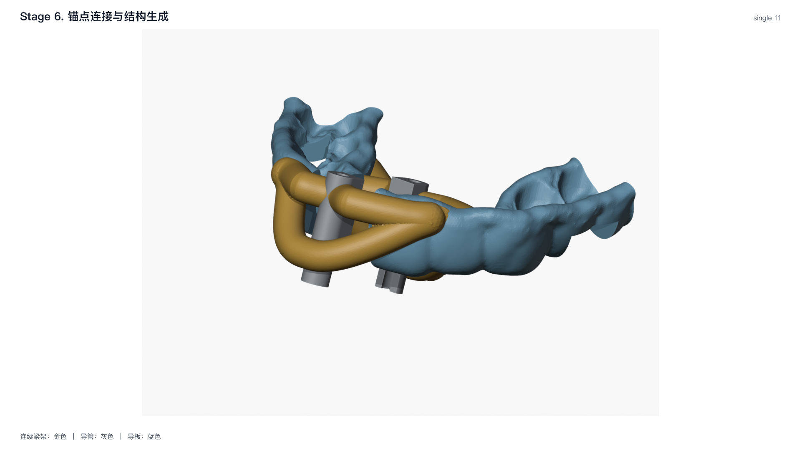

# 6. 连续梁架生成

**实现状态：实验。** 本阶段把第 4–5 阶段的离散锚点转换为
`PointLinkingPlan`：有序中心线、接触点索引、梁半径与实体化参数。
算法采用连续五次 Hermite 框架。

## 输入与拓扑

单种植位的每根导管有高、低两条路径：

$$
\mathbf S_L\longrightarrow\mathbf P^{\pm}
\longrightarrow\mathbf S_R,
$$

其中 $\mathbf S_L,\mathbf S_R$ 是导板端中心线锚点，
$\mathbf P^+$ 为导管高端，$\mathbf P^-$ 为低端。两根导管共生成四条主梁。

多种植位不将各种植位拆成独立梁架。一条同侧路径按 YAML 声明的
顺序经过所有导管锚点：

$$
\mathbf S_0\rightarrow
\mathbf P_1^{\pm}\rightarrow\cdots\rightarrow
\mathbf P_m^{\pm}\rightarrow\mathbf S_{m+1}.
$$

末端远中公共节点只是 $\mathbf S_{m+1}$ 的一种显式端点语义；
U 型延伸和跨组件桥接则以额外有序中心线加入同一计划。

## 1. 切平面内的切向

给定期望方向 $\mathbf v$ 和锚点表面法向 $\mathbf n$，曲线切向先投影到
局部切平面：

$$
\Pi(\mathbf v,\mathbf n)=
\operatorname{unit}\!\left[
\mathbf v-(\mathbf v\cdot\widehat{\mathbf n})\widehat{\mathbf n}
\right].
$$

这个约束使梁在接触处沿表面离开。投影长度不超过 $10^{-8}$ mm 时取
$\Pi(\mathbf v,\mathbf n)=\operatorname{unit}(\mathbf v)$。

## 2. 五次 Hermite 曲线

对两端 $\mathbf p_0,\mathbf p_1$ 及其一阶导数
$\mathbf m_0,\mathbf m_1$，$u\in[0,1]$ 时中心线为

$$
\mathbf C(u)=
h_0(u)\mathbf p_0+h_1(u)\mathbf m_0+
h_2(u)\mathbf p_1+h_3(u)\mathbf m_1,
$$

其中

$$
\begin{aligned}
h_0(u)&=1-10u^3+15u^4-6u^5,\\
h_1(u)&=u-6u^3+8u^4-3u^5,\\
h_2(u)&=10u^3-15u^4+6u^5,\\
h_3(u)&=-4u^3+7u^4-3u^5.
\end{aligned}
$$

因此

$$
\mathbf C(0)=\mathbf p_0,\quad
\mathbf C(1)=\mathbf p_1,\quad
\mathbf C'(0)=\mathbf m_0,\quad
\mathbf C'(1)=\mathbf m_1,\quad
\mathbf C''(0)=\mathbf C''(1)=\mathbf0.
$$

两段曲线在中间锚点共用同一切向，所以位置和一阶导数连续，
且每段的自身端点二阶导数为零。

## 3. 单个导管接触点

记左端、导管接触点和右端为
$(\mathbf L,\mathbf P,\mathbf R)$，对应法向为
$(\mathbf n_L,\mathbf n_P,\mathbf n_R)$。令
$d_L=\|\mathbf P-\mathbf L\|$、$d_R=\|\mathbf R-\mathbf P\|$，则

$$
\begin{aligned}
\mathbf m_L &=
\tau_e d_L\Pi(\mathbf P-\mathbf L,\mathbf n_L),\\
\mathbf m_P &=
\tau_c\frac{d_L+d_R}{2}
\Pi(\mathbf R-\mathbf L,\mathbf n_P),\\
\mathbf m_R &=
\tau_e d_R\Pi(\mathbf R-\mathbf P,\mathbf n_R).
\end{aligned}
$$

$\tau_e$ 和 $\tau_c$ 分别由 `connector_path.endpoint_tension` 和
`connector_path.contact_tension` 配置；默认值见[病例配置](../guide/configuration.md#runtimegeometry)。
$\mathbf L\rightarrow\mathbf P$ 与 $\mathbf P\rightarrow\mathbf R$ 两段共用
$\mathbf m_P$。

## 4. 多导管连续路径

对有序点 $\mathbf p_0,\ldots,\mathbf p_{m+1}$，内部锚点 $i$ 的切向为

$$
\mathbf m_i=
\tau_c
\min\left(
\|\mathbf p_i-\mathbf p_{i-1}\|,
\|\mathbf p_{i+1}-\mathbf p_i\|
\right)
\Pi(\mathbf p_{i+1}-\mathbf p_{i-1},\mathbf n_i).
$$

首尾切向分别使用相邻弦向，长度为弦长乘 $\tau_e$。每两个相邻点
之间生成一段 Hermite 曲线，保证路径按病例声明顺序经过所有导管。

## 5. 单种植位低端梁的局部下潜

该分支只用于没有 `multi_site_paths` 的单种植位普通路径。低端 $\mathbf P^-$
需要深埋，但整条梁不应跟着下移。先在导管外层建立代理点

$$
\mathbf P_{out}=\mathbf Q^-+(r-o_{low})\mathbf n^-.
$$

以 $\mathbf P_{out}$ 生成基线曲线 $\mathbf C_0$，其累计弧长为 $s$，
$\mathbf P_{out}$ 对应 $s_P$。局部合并半弧长取

$$
\ell_m=\min\left(
\ell_{cfg},\ 0.8s_P,\ 0.8(s_{end}-s_P)
\right).
$$

找到 $s_P-\ell_m$ 与 $s_P+\ell_m$ 处的左右拼接点，只将这一段替换为

$$
\mathbf L_m\rightarrow\mathbf P^-\rightarrow\mathbf R_m.
$$

左、右拼接点分别继承基线曲线的局部切向；$\mathbf P^-$ 处切向使用
$\Pi(\mathbf R_m-\mathbf L_m,\mathbf n^-)$。下潜范围局限于导管附近，
两侧基线路径保持不变。

多种植位连续路径不走这段代理点算法。高、低两条同侧路径都由第 4 节的
`_curve_through_multiple_contacts` 一次生成，低路径直接依次经过每根导管的
$\mathbf P_i^-$；这是当前代码的明确拓扑分支。

## 6. 离散与实体化

两锚点弦长为 $d$，目标间距为 $\Delta s$，每段样本数为

$$
N=\operatorname{nextOdd}\!\left(
\max\left(17,\left\lfloor\frac d{\Delta s}\right\rfloor+1\right)
\right).
$$

`connector_path.centerline_spacing_mm` 控制 $\Delta s$；
`curve_resolution` 控制梁截面细分。Blender 只消费这些中心线：沿折线使用平行传输
标架扫掠圆形截面，不重新选择锚点或改变拓扑。按压梁三臂是
$\mathbf p_i\rightarrow\mathbf J$ 的直线扫掠，汇合球半径为 $1.12r$。

实体梁在与导板融合前按配置执行牙列净距裁切；最终融合后再次复切
导孔和观察窗。

## 输出与质量检查

`stage-06-structure-linking.json` 对每条路径记录端点来源、导管顺序、
接触点索引、中心线长度和实体化参数；
`stage-06-structure-linking.png` 显示实际导管、导板与已实体化的全部梁。

规划阶段要求每条路径严格经过其有序锚点，中间接触点索引唯一且递增。
最终验证再独立检查梁中心线覆盖率、连续性、导孔保留和导板端强化结构。

## 代码对应

| 文档算法 | 当前代码入口 |
| --- | --- |
| 切平面投影与五次 Hermite 段 | `point_linking._projected_direction`、`_quintic_segment` |
| 单导管高端路径 | `_curve_through_contact` |
| 多种植位连续路径 | `_curve_through_multiple_contacts` |
| 单种植位低端局部下潜 | `_lower_curve_with_local_dive` |
| 拓扑装配与按压梁直线臂 | `point_linking.link_selected_points` |
| 圆截面扫掠和布尔顺序 | `blender.mesh_builders`、`blender.guide_modeling` |

*tooth-11 完整运行的第 6 阶段结果。金色为主连接梁和按压梁，灰色为标准导管，蓝色为导板；图中应能追踪每条梁的起点、经过导管和终点。*
