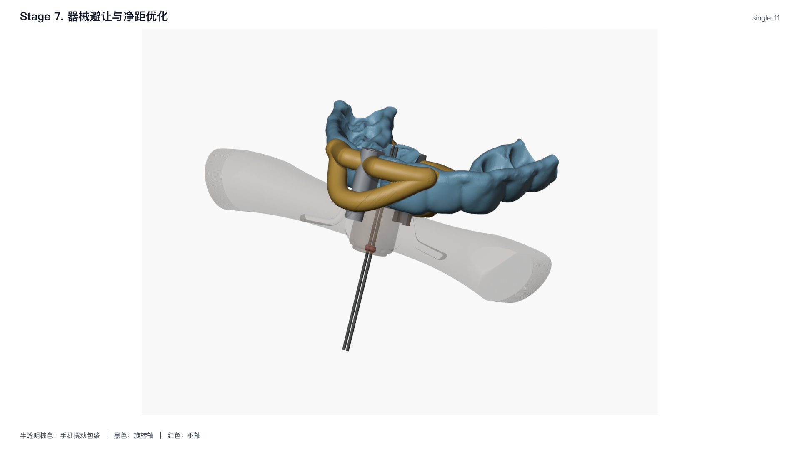

# 7. 手机摆动避让

**实现状态：实验。** 本阶段从真实手机 STL 构造当前装配深度下的
左右摆动包络，并将它作为完整模型的差集切除体。

## 输入与运动轴

对每个手机避让项，输入是手机网格 $B$、左右止挡面中心
$\mathbf c_L,\mathbf c_R$、止挡报告中的成对轴 $\mathbf a_0$、
最大摆角 $\theta_{max}$ 和姿态数 $N$。

旋转轴和枢轴为

$$
\mathbf a=\frac{\mathbf a_0}{\|\mathbf a_0\|},
\qquad
\mathbf p=\frac{\mathbf c_L+\mathbf c_R}{2}.
$$

轴长度为零、两片止挡面无法匹配或坐标非有限值时直接失败。
手机 STL 只使用表面积最大的连通分量，且该分量必须是封闭体。

## 1. 姿态离散

采样角等间距分布在

$$
\theta_j=-\theta_{max}+
\frac{2j}{N-1}\theta_{max},
\qquad j=0,\ldots,N-1.
$$

必须有某个 $j$ 使 $\theta_j=0$，以保证当前真实装配姿态被包含。
当前模型只定义绕 $\mathbf a$ 的有符号左右旋转，轴向位移恒为零。

## 2. 绕任意轴的旋转

绕单位轴 $\mathbf a$ 旋转 $\theta$ 的 Rodrigues 矩阵为

$$
\mathbf R_{\mathbf a}(\theta)=
\cos\theta\,\mathbf I+
(1-\cos\theta)\mathbf a\mathbf a^{\mathsf T}+
\sin\theta[\mathbf a]_{\times},
$$

其中 $[\mathbf a]_{\times}\mathbf x=\mathbf a\times\mathbf x$。手机上任意点 $\mathbf x$
在第 $j$ 个姿态中的位置为

$$
\mathbf x_j=\mathbf p+
\mathbf R_{\mathbf a}(\theta_j)(\mathbf x-\mathbf p).
$$

这里的枢轴 $\mathbf p$ 必须来自两个已匹配止挡面，不能用手机包围盒中心或
导板中心代替。

## 3. 运动包络

第 $j$ 个旋转后的手机体记为

$$
B_j=\left\{
\mathbf p+\mathbf R_{\mathbf a}(\theta_j)(\mathbf x-\mathbf p):
\mathbf x\in B
\right\}.
$$

离散运动包络是所有姿态的精确布尔并集：

$$
E_N=\bigcup_{j=0}^{N-1}B_j.
$$

实现使用 manifold3d 分批合并封闭网格。并集后只保留体积最大的连通分量；
其他分量只有在体积不超过 $10^{-4}\ \mathrm{mm}^3$ 时才被视为数值碎片。
任一更大独立分量都使本阶段失败。
此外，非封闭、绕向不一致或有向体积非正的分量按表面积检查；表面积大于
$10^{-4}\ \mathrm{mm}^2$ 也直接失败，不能按体积碎片静默丢弃。

## 4. 离散误差指标

令手机顶点到旋转轴的最大垂直距离为

$$
R_{max}=\max_{\mathbf x\in B}
\left\|
(\mathbf x-\mathbf p)-
[(\mathbf x-\mathbf p)\cdot\mathbf a]\mathbf a
\right\|.
$$

相邻姿态的最大角度步长为 $\Delta\theta$。两样本正中间的最大未采样
弦位移估计为

$$
\varepsilon_{half}=2R_{max}\sin\left(\frac{\Delta\theta}{4}\right).
$$

该量写入报告，用来评估姿态数是否足够；代码不会在不改变 YAML 的情况下
自动降低步长。

## 5. 最终差集

设第 6 阶段实体化、融合并复切导孔与观察窗后的整体为 $G_6$，
额外净距为 $\delta\ge0$。当 $\delta>0$ 时，源码实际使用
`Manifold.sphere(delta, circular_segments=4)` 生成的多面体 $S_\delta$，
而不是理想无限分辨率球。实际切除体为

$$
E_{\delta}=E_N\oplus S_{\delta}
=\left\{\mathbf x+\mathbf y:
\mathbf x\in E_N,\ \mathbf y\in S_\delta\right\}.
$$

最终结果为

$$
G_7=G_6\setminus E_{\delta}.
$$

默认 $\delta=0$。差集不保护导管、主连接梁或按压梁；任何进入
$E_{\delta}$ 的结构都必须被真实切除，随后由最终 STL 验证独立检查连通性。

## 缓存、输出与质量检查

缓存指纹完整包含手机 STL SHA-256、止挡报告 SHA-256、
$\theta_{max}$、$N$ 和并集批大小。只有指纹完全一致且缓存包络仍是封闭体时
才复用。

`stage-07-clearance-adjustment.json` 记录每个手机的轴、枢轴、角度序列、
$R_{max}$、$\varepsilon_{half}$、包络体积与额外净距。
`stage-07-clearance-adjustment.png` 在实际第 6 阶段结构上叠加真实运动包络，
并用黑色轴线和红色枢轴点表达运动定义。

本阶段的必检项是：0° 姿态存在、输入主体封闭、包络封闭、
无超容差独立分量、差集后主体仍唯一且最终 STL 通过结构与导孔验证。

## 代码对应

| 文档算法 | 当前代码入口 |
| --- | --- |
| 止挡轴、枢轴和输入校验 | `clearance_adjustment._stop_geometry`、`_load_mesh` |
| 姿态采样和 manifold3d 并集 | `_adjust_single_handpiece`、`_boolean_union` |
| 碎片与离散误差报告 | `_signed_volume`、`_adjust_single_handpiece` |
| 缓存指纹 | `clearance_adjustment._fingerprint`、`_cached_plan` |
| 额外净距和最终差集 | `blender.booleans.apply_manifold3d_differences`、`blender.guide_modeling` |

*tooth-11 完整运行的第 7 阶段结果。半透明棕色区域是由真实手机 STL 多姿态并集得到的摆动包络，黑色线是止挡报告给出的旋转轴，红色点是枢轴。*
